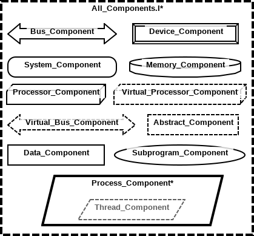
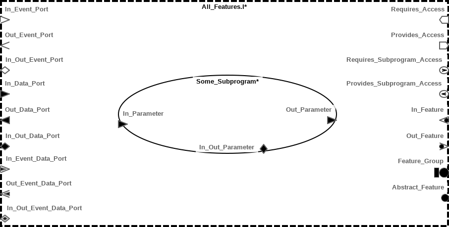
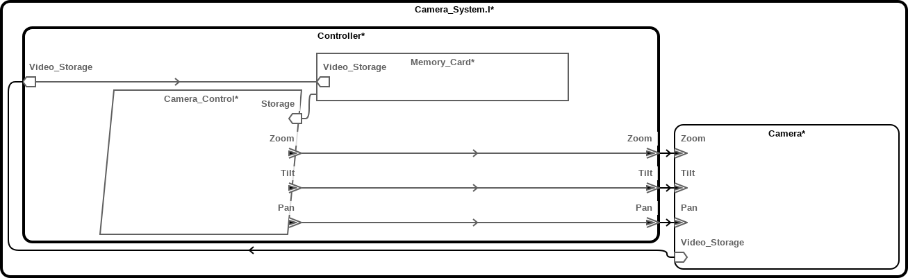

AADL Basics (or "So You Want to AADL")
======================================

At their core, AADL models are just annotated box-and-arrow diagrams. The boxes
represent hardware elements, such as a sensor, a processor, a microcontroller
board, etc., or software elements, such as a program, a thread, a procedure, or
a data object. The arrows represent the ways in which these elements interact
with each other, by sending data or signals, by accessing a bus or memory, or by
passing parameters into procedure calls. Lastly, any of these elements can be
annotated, to indicate, for example, the latency on a bus connection, or the
physical weight of a hardware component.

In contrast to some other modeling languages, such as UML, AADL has a fixed
semantics for its boxes and arrows. Different box shapes are used to represent
processors, memories, opaque hardware devices, software processes, etc., and the
conventions about which box type represents what are common across all models.
This makes AADL less general than UML, but it also means that AADL models are
used as precise specifications of a hardware and/or software system. Moreover,
it allows tools to perform a more detailed analysis.

AADL is both a diagrammatic language and a textual one. This means that any
model you create will have two representations: a box-and-arrow diagram and a
collection of machine-readable text, resembling a programming language. The
textual representation is still human-readable, of course, but looking at the
diagram is usually the easiest way for humans to understand a model. Having a
textual representation as well, however, allows tools to analyze models,
identify potential vulnerabilities, verify behavioral specifications, etc.

You can create an AADL model either by writing code or by drawing boxes and
arrows directly. Adding boxes and connections between them is typically much
faster to do in the diagram editor than by writing the specification by hand in
the textual format.  On the other hand, annotating diagrams is usually easier to
do directly in the code. So perhaps the best way to create a model is to
consider these two representations in conjunction, and move back and forth
between them as it makes sense to do so.

Getting Started: Packages
-------------------------

The first thing you'll want to do when starting a new model is create a
**package**. Every other piece of AADL you write will be contained within a
package (or a **property set**; more on that
[later](#user-content-property-sets)). Packages are AADL's module system, so you
can have as many of them as you want in a model, but each one has to be in a
separate file.

```aadl
package My_Package
public

-- Component declarations go here

end My_Package;
```

Elements defined in one package can be used in another. This is done by adding a
`with` clause with the name of the package you want to use in the package where
you want to use it. You can then use elements defined in the package using the
package name followed by the element name, separated by `::`.

```aadl
package My_Package
public

system My_System
end My_System;

end My_Package;
```

```aadl
package My_Other_Package
public
    -- This allows us to use elements defined in `My_Package`
    with My_Package;

system My_Other_System
end My_Other_System;

system implementation My_Other_System.Impl
    subcomponents
        Imported_System: system My_Package::My_System;
end My_Other_System.Impl;
```

The Boxes: Components
---------------------

The boxes in an AADL diagram are called components. Components come in
categories, and depending on their category, they can represent a physical
device, a unit of data or code, or a logical grouping of any of these.
Components are compositional, meaning that they can have implementations that
contain other components. The kinds of subcomponents a given component can have
differ by category.



### Hardware Components

| Category    | Can contain ...                      | Description                               |
| --------    | ---------------                      | -----------                               |
| `processor` | `memory`, `bus`, `virtual processor` | Device for scheduling and running threads |
| `bus`       |                                      | Hardware for communication functionality  |
| `memory`    | `memory`, `bus`                      | Storage for (non-)executable data         |
| `device`    | `bus`, `data`                        | Sensor or actuator                        |

In addition to the above, there are `virtual bus` and `virtual processor`
categories, which can appear anywhere their non-virtual counterparts can. These
are used to indicate that some other component provides the logical
functionality of a bus or processor without tying it to a single physical object
of that type. Notice that a `processor` can also contain a `virtual processor`
as a subcomponent. This is useful for indicating partitions of a processor.

As you can imagine, the `processor`, `bus`, and `memory` component categories
aren't very interesting unless you can associate logical elements with them.
For example, a communication channel is typically associated with a bus, data is
associated with the memory on which it's stored, and a thread is associated with
the process that runs it. In AADL, these associations are indicated with
[properties](#user-content-associating-logical-and-physical-elements).

### Software Components

| Category     | Can contain ...      | Description                                                |
| --------     | ---------------      | -----------                                                |
| `process`    | `data`, `thread`     | Address space, e.g., an OS process or ARINC653 partition   |
| `thread`     | `data`, `subprogram` | Path of execution within a process                         |
| `data`       | `data`, `subprogram` | Structured data stored within or passed between components |
| `subprogram` | `data`, `subprogram` | Piece of executable code stored within a component         |

Along with these categories, there are also `thread group` and `subprogram
group` categories. These are useful when you have many `thread` or `subprogram`
components, and you want to logically group them to reduce the complexity of
your model. They can each contain components of the same category and shared
`data` and `subprogram` resources, as well as other groups.

### Other Components

| Category   | Can contain ...     | Description                                                      |
| --------   | ---------------     | -----------                                                      |
| `system`   | any except `thread` | Logical grouping of software and hardware components             |
| `abstract` | any                 | An "undecided" component that can stand in for any of the others |

The `system` category is the one you are likely to encounter most often. In
general, it represents a physical component that is comprised of other physical
components, and forms a logical grouping. Often, it will correspond to a
particular plastic box and all the components it physically contains, but
there's no reason to limit yourself to that. Use whatever grouping makes the
most sense.

The `abstract` category is unique in that it may contain and be contained by a
component of any other category. It is used when you wish to leave some parts of
a model to be filled in later, including what component category something
should be realized by. For example, you might not know at some stage of design
whether to call a GPS component a `device`, meaning that you want to treat it as
a black box, or a `system`, meaning that you want to give it some internal
structure. In this case, you can add it as an `abstract` component, and then
[extend](#user-content-abstract-components) it once you've made up your mind.
Abstract model elements are also used to represent component environments and
dependencies when modularly reasoning about system designs and their
implementations.

### Types, Implementations, and Instances

There are three stages to creating a component in AADL. These boil down to:

1. describing what **type** of component it is—i.e., how it interacts with other
   components;
2. **implementing** the component by describing its internal structure and any
   implementation-specific attributes; and
3. **instantiating** the component by adding it as a subcomponent somewhere in
   your model.

At the top level of an AADL "model" is (typically) a `system` component. It's a
good idea to give the type of this system a descriptive name if there's one that
makes sense (e.g., `Boat` or `Unmanned_Aerial_System`). If there is no
descriptive name that makes sense, however, AADL convention is to call this
top-level system type `Complete`.  There is nothing preventing you from having
multiple top-level systems, although it is then perhaps best to say that you
have multiple "models". The top-level system of a model is the one component
that never gets instantiated, since it is not a subcomponent of anything else.

An implementation has the name of the corresponding type as well as an
implementation name, separated by a `.` character. For example,
`Flight_Controller.PX4` implements the `Flight_Controller` type, and the
implementation's name is `PX4`. If a type will have only one implementation, and
there is no implementation name that makes sense, it is standard to call this
implementation `Impl` or just `I`, for instance, `Unmanned_Aerial_System.I`.
This is also commonly done with the top-level `Complete` type (`Complete.Impl`).

Instantiating a component involves placing it in the `subcomponents` block of a
different component's implementation. Each instance has a name, which is scoped
to the component implementation in which it appears (so it may or may not have
the same name as the corresponding type). A component can be instantiated any
number of times, corresponding to the number of identical copies of it that
appear in the system being modeled. For instance, a multiprocessing server has
multiple identical processors, and an airplane may have two or more braking
systems for redundancy.

```aadl
-- Top-level system type. This is empty, since the top-level system has no
-- interface to other components.
system Complete
end Complete;

-- Top-level system implementation. Here, we wish to model the interaction
-- between an airplane and a communications tower, so we add instances of both.
system implementation Complete.I
    subcomponents
        Airplane: system Airplane.I;       -- Instance can be named same as type...
        Comms_Tower: system Comm_System.I; -- ... but doesn't have to be.
    connections
        -- Connections between the airplane and the communications tower go
        -- here.
end Complete.I;

system Airplane
    features
        -- This component's interface to other components goes here. More on
        -- this in the next section.
end Airplane;

system implementation Airplane.I
    subcomponents
        Primary_Braking: system Braking;
        Backup_Braking: system Braking;
        Braking_Monitor: system;
    connections
        -- Connections among the braking systems go here.
end Airplane.I;

system Braking
    features
        -- ...
end Braking;
```

Typically you instantiate an implementation, as in the `Airplane`
and`Comms_Tower` instances above. But you can also instantiate a type, as in the
`Primary_Braking` and `Secondary_Braking` instances, or even just a component
category, as in `Braking_Monitor`. Instantiating types and categories will leave
you with a model that is not fully specified.  Doing so is useful to elide some
data from an early version, or an abstracted version, of a model. The model can
later be [extended](#user-content-extending-a-model) to specify the
implementations for these instances.

The Arrows: Features, Connections, and Flows
--------------------------------------------



A box-and-arrow diagram isn't very interesting without arrows connecting the
boxes. An AADL `feature` represents the point at which one of these arrows can
connect to a component (the "arrowhead"). This will often represent a
communication channel, but it may also represent a direct access to data or a
bus. In the case of a `subprogram`, this can also be a parameter passed in or
out of the corresponding procedure. Features are defined in a `features` block
within `system`s, `process`es, `device`s, and `abstract`s.

Features come in many forms, from abstract (simply using the `feature` keyword)
to concrete (e.g., a synchronous data channel).  Different keywords, and thus
different diagrammatic representations, are used to denote these various kinds
of endpoints of connections.

### Component Interfaces using Features

| Feature             | Directions             | Description                                           |
| -------             | ----------             | -----------                                           |
| `data port`         | `in`, `out`, `in out`  | Synchronous data channel                              |
| `event port`        | `in`, `out`, `in out`  | Asynchronous signal carrying no data                  |
| `event data port`   | `in`, `out`, `in out`  | Asynchronous data channel                             |
| `data access`       | `requires`, `provides` | Non-executable data                                   |
| `subprogram access` | `requires`, `provides` | Executable data                                       |
| `bus access`        | `requires`, `provides` | Access to a bus outside of the current component      |
| `parameter`         | `in`, `out`, `in out`  | Parameter to a subprogram                             |
| `feature`           | `in`, `out`            | Abstract or "undefined" feature to be filled in later |

Note that port connections do not necessarily correspond to physical ports on a
device. More often, each kind of data sent or received by a component gets its
own port, as the port's type denotes what kind of data is sent or received over
the connection. The same is true of `data access` features. They generally
correspond to a piece of structured data, rather than a physical connection.

Each `port`, `data access`, and `parameter` feature may have a `data` type or
implementation associated with it. Similarly, `subprogram access` features may
have an associated `subprogram` type or implementation. This corresponds to the
kind of data passed through this feature. If a `data` or `subprogram`
implementation is not associated with the feature, the model is not fully
specified. The model may later be [extended](#user-content-extending a model) to
fill this information in.

```aadl
-- A camera that takes pan, tilt, and zoom commands asynchronously and stores
-- video to an external storage device.
system Camera
    -- Features are defined within a block in the component type.
    features
        Video_Storage: requires data access Video;

        -- Synchronous pan, tilt, and zoom controls. The data they consume is an
        -- unsigned 16-bit integer, defined in the built-in Base_Types package.
        -- In order to use this type, our package must have a `with Base_Types`
        -- clause at the top.
        Pan: in event data port Base_Types::Unsigned_16;
        Tilt: in event data port Base_Types::Unsigned_16;
        Zoom: in event data port Base_Types::Unsigned_16;
end Camera;

data Video
end Video;
```

In addition to the above, there is also a `feature group`, which is defined like
a component type and contains other features. For example, the camera model we
defined above could group the pan, tilt, and zoom ports into a single logical
feature.

```aadl
-- This version of the camera groups the pan, tilt, and zoom features into a
-- feature group.
system Camera_With_PTZ
    features
        Video_Storage: requires data access Video;
        Pan_Tilt_Zoom: feature group Pan_Tilt_Zoom;
end Camera_With_PTZ;

feature group Pan_Tilt_Zoom
    features
        Pan: in event data port Base_Types::Unsigned_16;
        Tilt: in event data port Base_Types::Unsigned_16;
        Zoom: in event data port Base_Types::Unsigned_16;
end Pan_Tilt_Zoom;
```

### Connecting Features

The lines in the box-and-arrow diagram represent connections between components,
or more precisely between the features of component instances. These connections
are defined in the component implementation enclosing the component instances
that are being connected. The features of the enclosing component implementation
may also be connected to features of subcomponent instances, indicating that the
external connection is routed to the given internal component.

Connections are declared in a `connections` block in component implementations.
When declaring a connection, you first give it a name, then indicate the
connection category, and finally indicate the connection endpoints with an arrow
in between.  The arrow (`->` or `<->`) placed between the connection endpoints
indicates the direction of data flow. There is no `<-`, so if you want to
declare a unidirectional connection, the source endpoint must appear first.
Arrows in `port` connections must match the direction of the endpoint features
(`Out_Port -> In_Port`, etc.).

The following example connects the `Camera` from the previous section to a
`Camera_Controller`. The `Camera_Controller` contains a process that sends pan,
tilt, and zoom messages to the camera, as well as a memory card. The data access
provided by the `Camera_Controller` is routed to the `Video` data access on the
memory card. Notice that external access to the `Video` data in the
`Camera_Controller` is write-only, as indicated by the direction of the arrows.
In contrast, the `Camera_Control` process has read-write access to the *entire*
memory card, indicated by the bidirectional arrow connected to the data instance
itself.



```aadl
system Camera_System
end Camera_System;

system implementation Camera_System.I
    subcomponents
        Camera: system Camera;
        Controller: system Camera_Controller.I;
    connections
        Camera_Video_Storage: data access Camera.Video_Storage -> Controller.Video_Storage;

        Pan_Control: port Controller.Pan -> Camera.Pan;
        Tilt_Control: port Controller.Tilt -> Camera.Tilt;
        Zoom_Control: port Controller.Zoom -> Camera.Zoom;
end Camera_System.I;

system Camera_Controller
    features
        Video_Storage: provides data access Video;

        Pan: out event data port Base_Types::Unsigned_16;
        Tilt: out event data port Base_Types::Unsigned_16;
        Zoom: out event data port Base_Types::Unsigned_16;
end Camera_Controller;

system implementation Camera_Controller.I
    subcomponents
        Memory_Card: data Memory_Card;
        Camera_Control: process Camera_Control;
    connections
        -- Write-only access to video storage on the memory card.
        Memory_Card_Video: data access Video_Storage -> Memory_Card.Video_Storage;

        -- Read-write access to the entire memory card.
        Camera_Control_Storage: data access Camera_Control.Storage <-> Memory_Card;

        Pan_Control: port Camera_Control.Pan -> Pan;
        Tilt_Control: port Camera_Control.Tilt -> Tilt;
        Zoom_Control: port Camera_Control.Zoom -> Zoom;
end Camera_Controller.I;

process Camera_Control
    features
        Storage: requires data access Memory_Card;

        Pan: out event data port Base_Types::Unsigned_16;
        Tilt: out event data port Base_Types::Unsigned_16;
        Zoom: out event data port Base_Types::Unsigned_16;
end Camera_Control;

data Memory_Card
    features
        Video_Storage: provides data access Video;
end Memory_Card;
```

### Specifying Data Flow

Features and connections allow us to express the flow of signals and data from
one component to another, but not the logical flow of information through
multiple components in a model. For this, we can use **flows**. Three kinds of
flows are available for component types:

1. A **flow source** indicates that data or signals originate in this component
   and are sent out a particular feature.
2. A **flow path** indicates that data or signals sent into a given feature of
   this component result in data or signals (not necessarily of the same kind)
   being sent out of a different feature.
3. A **flow sink** indicates that data or signals are received and consumed by a
   particular feature of this component.

Component implementations define the sequence of connections and subcomponent
flows that comprise the flows declared on their types. In addition,
implementations can define **end to end flows**, which are entirely contained
within the component implementation (and thus are not mentioned in its type).

```aadl
system Video_System
end Video_System;

system implementation Video_System.I
    subcomponents
        Producer: system Video_Producer.I;
        Processing: system Video_Processor;
        Consumer: system Video_Consumer;
    connections
        Producer_To_Processing: port Producer.Video_Out -> Processing.Raw_Video;
        Processing_To_Consumer: port Processing.Cooked_Video -> Consumer.Video_In;
    flows
        Video_Flow: end to end flow
            Producer.Video_Source -> Producer_To_Processing ->
            Processing.Video_Path -> Processing_To_Consumer ->
            Consumer.Video_Sink;
end Video_System.I;

system Video_Producer
    features
        Video_Out: out data port;
    flows
        Video_Source: flow source Video_Out;
end Video_Producer;

system implementation Video_Producer.I
    subcomponents
        Camera: device Camera;
        Encoder: system Video_Encoder;
    connections
        Camera_To_Encoder: port Camera.Video_Out -> Encoder.Video_In;
        Encoder_Out: port Encoder.Video_Out -> Video_Out;
    flows
        Video_Source: flow source
            Camera.Video_Source -> Camera_To_Encoder ->
            Encoder.Video_Path -> Encoder_Out ->
            Video_Out;
end Video_Producer.I;

device Camera
    features
        Video_Out: out data port;
    flows
        Video_Source: flow source Video_Out;
end Camera;

system Video_Encoder
    features
        Video_In: in data port;
        Video_Out: out data port;
    flows
        Video_Path: flow path Video_In -> Video_Out;
end Video_Encoder;

system Video_Processor
    features
        Raw_Video: in data port;
        Cooked_Video: out data port;
    flows
        Video_Path: flow path Raw_Video -> Cooked_Video;
end Video_Processor;

system Video_Consumer
    features
        Video_In: in data port;
    flows
        Video_Sink: flow sink Video_In;
end Video_Consumer;
```

Annotating Elements with Properties
-----------------------------------

AADL allows nearly every aspect of a model to be annotated using **properties**.
Properties are typed key-value pairs, where the keys, along with their types and
the model elements to which they apply, are either built-in or user-defined in
**property sets**. The types that are available for use include integers, reals,
booleans, and strings, as well as lists, structs, and enumerated types. Property
sets also allow users to define units and unit conversions, which can be
attached to properties.

Properties often represent non-functional aspects of a model, such as a thread's
dispatch policy, the latency of a connection, or the physical weight of a
device, but can also reflect structural aspects that are not expressed
elsewhere, such as associating logical and physical components.

Property associations are specified in a `properties` block within a component
type or implementation. In addition, properties can be attached directly to a
specific component instance, or also at the point at which a feature,
connection, etc., is created. The following specification shows an example of
making property associations at various points in a model. The features
(`My_Int_Prop`, `My_Real_Prop`, etc.) must be defined in a property set
(`My_Props`), as we demonstrate [below](#user-content-property-sets).

```aadl
package IMU
public
    with My_Props; -- This lets us include properties from this property set

    system Inertial_Measurement_Unit
        features
            Pitch: out data port;
            Roll: out data port;
            Yaw: out data port {
                -- Property association on a feature
                My_Props::My_Int_Prop => 9999;
            };
        properties
            -- Property association within a component type
            My_Props::My_Bool_Prop => true;
    end Inertial_Measurement_Unit;

    system implementation Inertial_Measurement_Unit.I
        subcomponents
            Gyro: device Gyroscope.I;
            Accel: device Accelerometer.I {
                -- Property association on a component instance
                My_Props::My_Real_Prop => 3.14159;
            };
        connections
            Gyro_Pitch: port Gyro.Pitch -> Pitch;
            Gyro_Roll: port Gyro.Roll -> Roll {
                My_Props::My_List_Prop => (55, 66, 77); -- A list of integers
                My_Props::My_Range_Prop => 3 .. 10;
            };
            Gyro_Yaw: port Gyro.Yaw -> Yaw;
        properties
            -- Property association within a component implementation
            My_Props::My_String_Prop => "blah";
            -- Property associations on subcomponents can be made for multiple
            -- elements at once.
            My_Props::My_List_Prop => (2, 3, 4, 5)
                applies to Gyro_Pitch, Gyro_Yaw;
    end Inertial_Measurement_Unit.I;

    -- Definitions of Gyro, Accel, etc. go here
end IMU;
```

### Associating Logical and Physical Elements

In AADL, a `process` is logically contained within a system, a `thread` is
contained within a `process`, and connections are contained within component
instances. In another sense though, a connection runs on a bus, a process is
stored within a memory, and a thread runs on a processor. Properties are used to
make these latter associations.

The relevant built-in, predeclared properties are `Actual_Connection_Binding`,
`Actual_Memory_Binding`, and `Actual_Processor_Binding`. Each of these
properties takes a list of component instances as values, indicating the
hardware to which these logical elements are bound. The values are lists to
allow for cases in which a connection flows over multiple buses in sequence, a
thread's code and data are stored in different memories, or a thread can be
scheduled on multiple processors, for example.

Since these are [predeclared properties](#user-content-built-in-properties),
there is no need to include them using a `with` block to bring them into scope.
For more information, you can read `Deployment_Properties.aadl` in the AADL
Navigator of any OSATE project, under `Plug-in Contributions ->
Predeclared_Property_Sets`.

```aadl
package Flight_System
public
    system Flight_System
    end Flight_System;

    system implementation Flight_System.I
        subcomponents
            IMU: system Inertial_Measurement_Unit.I;
            FC: system Flight_Controller.I;

            SMBus: bus;
        connections
            Pitch: port IMU.Pitch -> FC.Pitch;
            Roll: port IMU.Roll -> FC.Roll;
            Yaw: port IMU.Yaw -> FC.Yaw;
        properties
            -- Associating connections with a bus
            Actual_Connection_Binding => (reference(SMBus))
                -- The "reference" keyword ^ allows us to associate an instance.
                applies to Pitch, Roll, Yaw;
    end Flight_System.I;

    system Flight_Controller
        features
            Pitch: in data port;
            Roll: in data port;
            Yaw: in data port;
    end Flight_Controller;

    system implementation Flight_Controller.I
        subcomponents
            Flight_Control: process Flight_Control.I;

            RAM: memory;
            -- Redundant processors, for illustration's sake
            CPU1: processor;
            CPU2: processor;
        properties
            -- Associating a process with a memory
            Actual_Memory_Binding => (reference(RAM))
                applies to Flight_Control;
            -- Associating a thread with the processors it can be scheduled on
            Actual_Processor_Binding => (reference(CPU1), reference(CPU2))
                applies to Flight_Control.Main_Loop;
    end Flight_Controller.I;

    process Flight_Control
    end Flight_Control;

    process implementation Flight_Control.I
        subcomponents
            Main_Loop: thread;
    end Flight_Control.I;
end Flight_System;
```

### Property Sets

A **property set** is a module containing property definitions. Similar to
[packages](#user-content-getting-started-packages), each property set is
contained in its own file. This file contains declaration for properties, types,
units, and constants.

```aadl
property set My_Props is

    -- A property declaration has a name, a type, and a list of AADL elements it
    -- can be applied to.
    My_Bool_Prop: aadlboolean applies to (system, feature, connection);
    My_Int_Prop: aadlinteger applies to (processor, memory implementation);
    My_Real_Prop: aadlreal applies to (end to end flow, device);
    My_Range_Prop: range of aadlinteger applies to (connection);
    My_List_Prop: list of aadlinteger applies to (device); -- A list type
    My_String_Prop: aadlstring applies to (all); -- Applies to all elements

    -- Type declarations allow user-defined types, like enumerations and records
    My_Record_Type: type record (
        Bool_Field: aadlboolean;
        Real_Field: aadlreal;
        List_Field: range of aadlinteger;
    );
    My_Enum_Type: type enumeration ( My_Enum1, My_Enum2, My_Enum3 );

    -- When declaring properties with user-defined types, the qualified name
    -- must be used, even if the type was declared in the same property set.
    My_Record_Prop: My_Props::My_Record_Type applies to (system);
    My_Enum_Prop: My_Props::My_Enum_Type applies to (system);

    -- Numeric properties can also have units. These are either user defined or
    -- from built-in property sets.
    My_Length_Units: type units (mm, cm => mm * 10, m => cm * 100);
    My_Length_Type: type aadlreal units My_Props::My_Length_Units;
    My_Length_Prop: My_Props::My_Length_Type applies to (all);

end My_Props;
```
