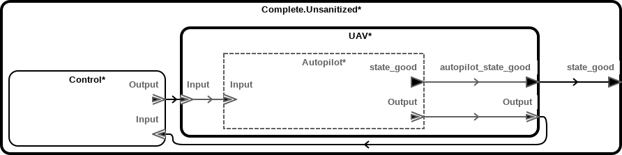
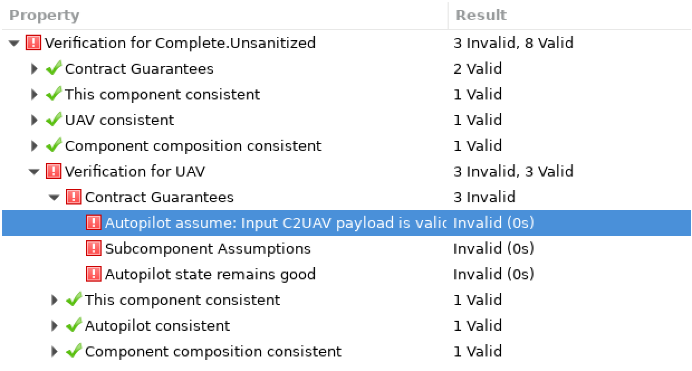
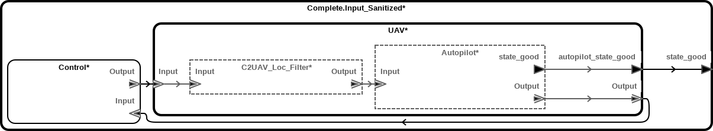
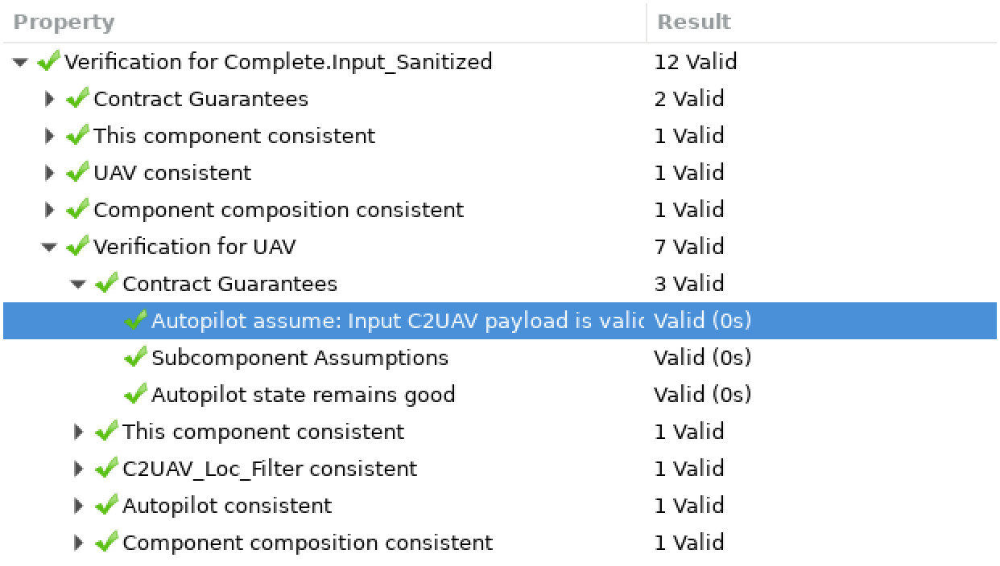
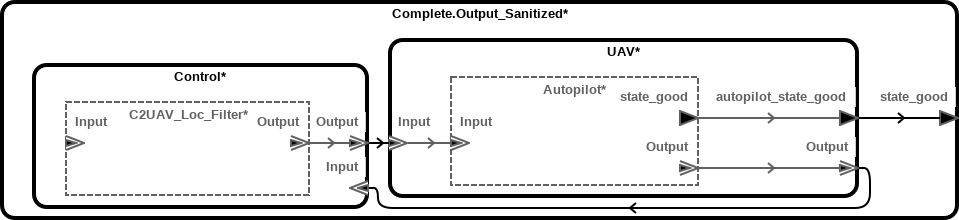
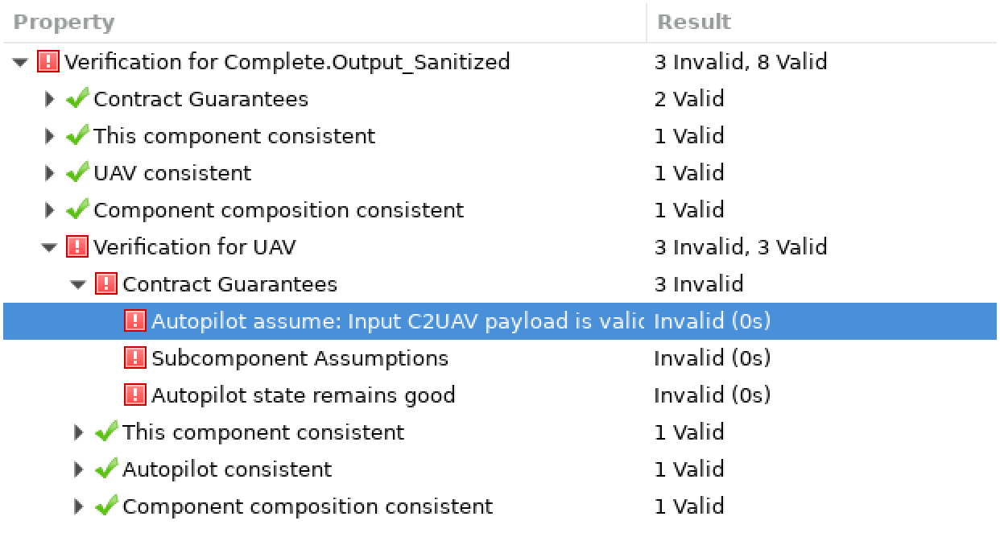

Message Filters, or "So You Want to Validate Your Data"
===============

Goal
----

Model a system made up of communicating components whose functionality
depends on values in the messages being within a certain allowed range.
Use model checking to show how this criterion can fail to be met. Add a filter
component and use model checking to prove that the criterion now holds.

An Unmanned Aerial System (UAS)
-------------------------------

Suppose you want to model an unmanned aerial system (UAS), with a controller
and a vehicle that exchange messages back and forth. A skeleton for such a
system might look like this:



The `Control` system is a black box at this stage of analysis; the only thing
we know about it is that it sends and receives messages. The UAV is mostly a
black box as well, except that we've identified an autopilot functionality
that receives the messages the controller sends and presumably operates the
various actuators on the UAV. Note that, while `Control` and `UAV` are modeled
as hardware systems, the autopilot is modeled as an abstract component. This
represents an early stage in the process of reverse engineering the UAS: We
know that the autopilot functionality exists, but we haven't yet established
the UAV's internal structure.

The `Control` system sends messages to the `UAV` system, which are forwarded
on to an `Autopilot` component. These messages contain a latitude and a
longitude, which represent the vehicle's next waypoint:

```aadl
data implementation Payload.C2UAV_Loc extends Payload.Base
subcomponents
    Latitude  : data Base_Types::Float;
    Longitude : data Base_Types::Float;
end Payload.C2UAV_Loc;
```

The UAV's autopilot, in turn, sends messages about its current position
(latitude, longitude, altitude) back to the controller:

```aadl
data implementation Payload.UAV2C_Loc extends Payload.Base
subcomponents
    Altitude  : data Base_Types::Float;
    Latitude  : data Base_Types::Float;
    Longitude : data Base_Types::Float;
end Payload.UAV2C_Loc;
```

One important property to model is that the UAV, and thus the autopilot,
behaves correctly. This behavior most likely has to do with the UAV's
actuators---for example, we might want to ensure that the propellers don't
turn off while the UAV is in the air. For now we use a simplifying shortcut
and just attach a boolean port called `state_good` to the autopilot asserting
whether it is in a good state.

Modeling Functional Requirements
--------------------------------

Suppose that, in further examining the UAS, you experimentally discover a bug:
You can crash the autopilot by sending `C2UAV_Loc` messages with a latitude
greater than 180 or a longitude greater than 360. Obviously, if you were
designing this system from scratch, you would want your autopilot to handle
this case gracefully. But if you are describing an existing system, you have
to work with what you have.

You can annotate functional requirements like this in several ways. But here, 
we will use the AGREE annex, so that we can formally analyze whether our 
requirements are met or not. The above requirements can be stated as follows in
 the `Autopilot` type:

```aadl
abstract Autopilot
features
    Input      : in  event data port Msg::Msg.C2UAV_Loc;
    Output     : out event data port Msg::Msg.UAV2C_Loc;
    state_good : out       data port Base_Types::Boolean;
annex agree {**
    assume "Input C2UAV payload is valid, if present" :
        event(Input) => in_c2uav_loc_payload_valid;
    guarantee "Autopilot state remains good" : state_good;

    property in_c2uav_loc_payload_valid =
        Input.Payload.Latitude  <= 180.0 and
        Input.Payload.Longitude <= 360.0;
**};
end Autopilot;
```

The important thing to notice here is that the guarantee that the autopilot
remains in a good state is predicated on an assumption that every message it
receives has a valid payload, which is defined as not having a latitude
greater than 180 or a longitude greater than 360. In other words, this models
a crash if the latitude or longitude is out of bounds.

The autopilot's `state_good` is a meta-variable that allows us to express a
crash in the autopilot. By adding ports to the `UAV` and `Complete` systems as
well, we can express the autopilot crashing in systems up to the top level:

```aadl
system UAV
features
    Input                : in  event data port Msg::Msg.C2UAV_Loc;
    Output               : out event data port Msg::Msg.UAV2C_Loc;
    autopilot_state_good : out       data port Base_Types::Boolean;
annex agree {**
    guarantee "Autopilot state remains good" : autopilot_state_good;
**};
end UAV;
```

```aadl
system Complete
features
    state_good : out data port Base_Types::Boolean;
annex agree {**
    guarantee "State remains good" : state_good;
**};
end Complete;
```

Finding and Fixing Bugs
-----------------------

The `Complete.Unsanitized` system implementation pictured above simply
connects the UAV and the controller and assumes the above criterion as a
condition that the autopilot's state remains. Running AGREE on this
implementation shows, as you might expect, that the condition is not
satisfied: There's nothing preventing the autopilot from receiving an
incorrectly formatted message.



Viewing the corresponding counterexample illustrates a simple case in which
the controller sends a message with latitude greater than 180, which puts the
autopilot into a bad state.

 => event(Input) and Output = Input;
    guarantee "Output is present only if input payload is valid" :
        event(Output) <=> input_payload_valid;

    property input_payload_valid =
        Input.Payload.Latitude  <= 180.0 and
        Input.Payload.Longitude <= 360.0;
**};
end C2UAV_Loc_Filter;
```

`C2UAV_Loc_Filter` is an abstract component because we are agnostic at this
point about how it is implemented. Its sole function, expressed in the two
AGREE guarantees, is to allow messages to pass through if they are correctly
formatted, or drop them otherwise. Note that this must be done using AGREE,
rather than connecting the input and output in an AADL implementation, both
because we need to model non-trivial connection behavior, and because direct
connection between external ports is illegal in AADL.

### Placing the Filter

The next question is where in our implementation this filter should be placed.
The most robust place to put it is within the UAV implementation, so that all
incoming messages are filtered before they reach the autopilot. The following
UAV implementation does just that:



`Complete.Input_Sanitized` is the same as our previous top-level
implementation, except that it places the filter we just created inside the
UAV to ensure that any message the UAV receives is filtered before being
passed on. We can check to see if this solves our problem using AGREE.



The AGREE output shows us that this solves our problem. But what if we wanted
to place the filter somewhere else? For example, we might want to filter
messages as the controller outputs them instead. Such an implementation might
look like this:



`Complete.Output_Sanitized` is similar to the above, except that it performs
sanitization within the Controller implementation. This guarantees that any
messages output by the controller will have a payload that is within bounds
for the autopilot. Once again, we use AGREE to check whether this works.



Filtering the output of the controller is *not* sufficient, since nothing in
our architecture guarantees that messages received by the UAV must come from
the controller. If we were to put the UAV into a different environment---say,
one where other components might have access to the same input port---the
autopilot's precondition might not be satisfied.

More specifically, when AGREE checks to ensure that the assumptions for a
component are satisfied, it only checks the immediate environment. As
demonstrated here, this can be useful because it requires the model to
guarantee either that a component's preconditions are satisfied in *any*
environment.
