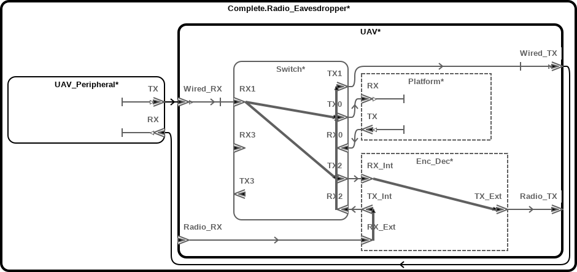
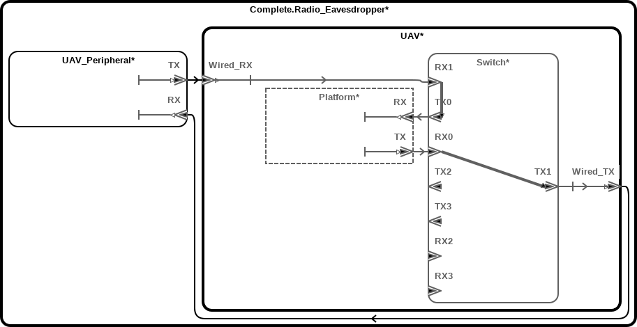
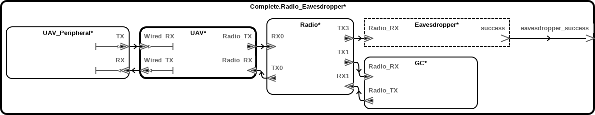
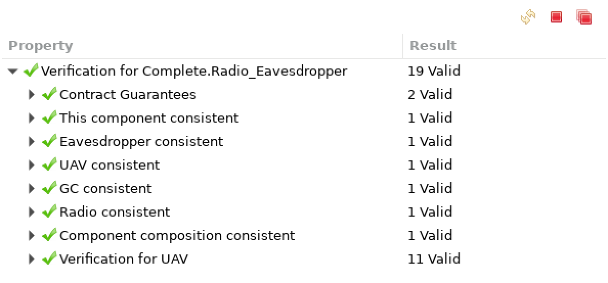
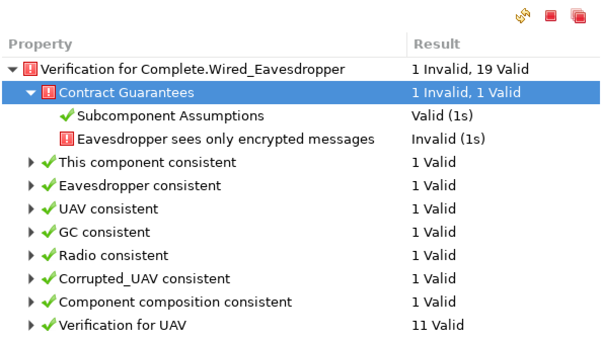
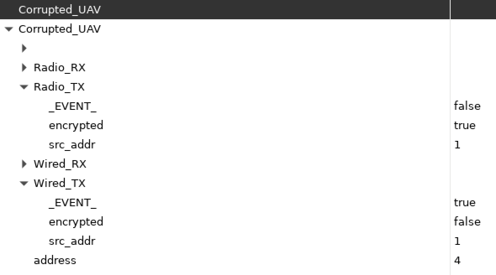
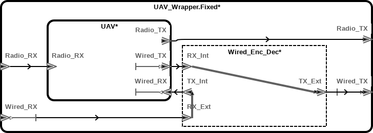
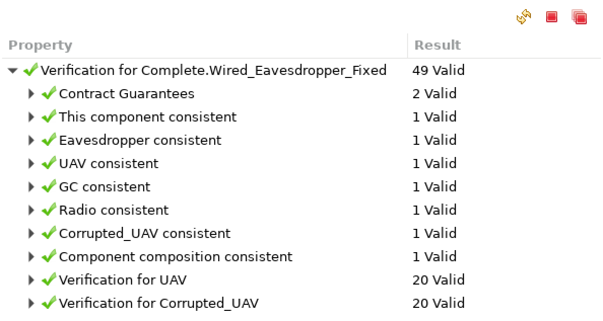
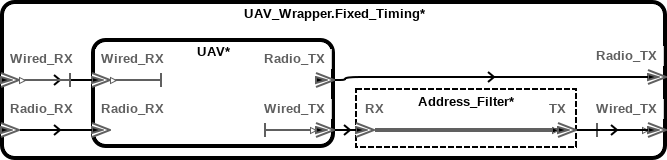
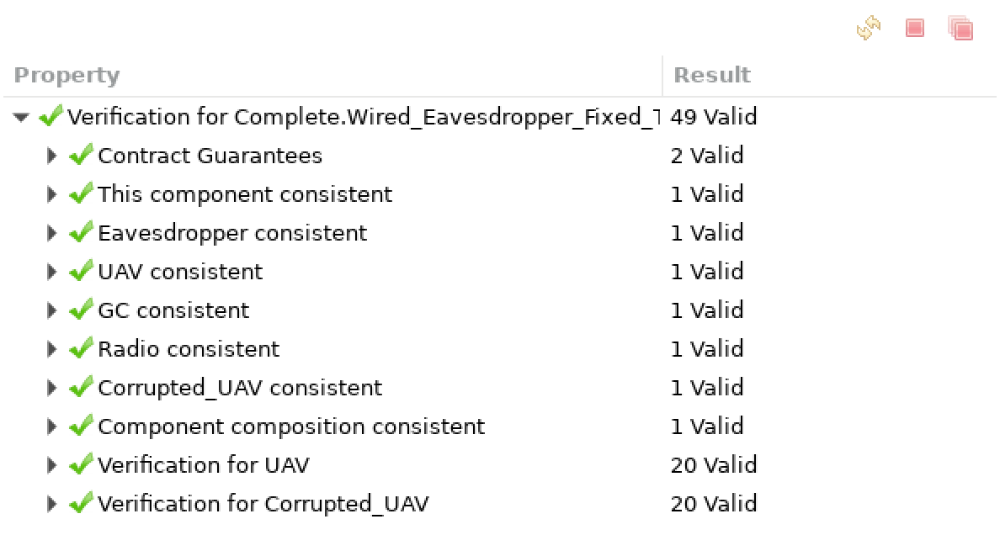

So You Want To Make Sure Your Data Is Encrypted
================================================

Goal
----

Model a system UAV system with an encrypted radio connection to a ground
controller and an unencrypted wired connection to a peripheral, such as a
camera, with latency constraints. We use a combination of AADL flows and AGREE
contracts to balance the need for secure communication with our timing
constraints.

We add an eavesdropper and show that the system is insecure in the setting
where the eavesdropper is able to capture a UAV and use it as a blackbox to
decrypt communications. Finally, we show how to modify the system so that it
is secure against this attack model, while respecting timing constraints.

A UAV System
------------



In this example, we assume we have been given a UAV to model. The UAV has an
autopilot, a flight controller, etc. But since we are primarily interested in
the external communications of the UAV, we simplify our model by representing
them as a single `Platform` component.

The platform sends messages (ethernet frames, say), which might be addressed
to the ground station or to a peripheral. These messages go to a 4-port hub,
where any message received on an RX port is sent to out on all other TX ports
(see the [hub example](../layer-2_hub/README.md)). Peripherals are plugged
directly into switchport 1 via the `Wired` interface. The ground station (or
anything else that happens to be listening or transmitting on the right
frequency) is logically connected to switchport 2. Messages sent or received
over radio, however, first pass through a transparent `Enc_Dec` module, which
encrypts outgoing messages and decrypts incoming ones.

Timing Constraints
------------------

We will use AADL flows to model constraints on the latency of our UAV's
on-board communications. Although there would certainly be many such
constraints on a real system, for this example, we will limit ourselves to
constraints on the latency when communicating with peripherals connected via
the `Wired` interface. In other words, we are interested in the following
end-to-end flows:



Flow paths can be assigned minimum and maximum latencies. In this case, we
assign a latency to the flow from each RX port to each TX port on `Hub4`,
representing the time it takes to switch the packets, as follows:

```aadl
system Hub4
-- ...
flows
    RX0toTX1 : flow path RX0 -> TX1;
    -- ...
    RX3toTX2 : flow path RX3 -> TX2;
properties
    Latency => 0 ms .. 10 ms applies to
        RX0toTX1, RX0toTX2, RX0toTX3,
        RX1toTX0, RX1toTX2, RX1toTX3,
        RX2toTX0, RX2toTX1, RX2toTX3,
        RX3toTX0, RX3toTX1, RX3toTX2;
```

Our encryption subsystem, `Enc_Dec_Module`, also has latencies, which
represent the time it takes to encrypt or decrypt a message. These will come
into play later.

```aadl
abstract Enc_Dec_Module
-- ...
flows
    InttoExt : flow path RX_Int -> TX_Ext;
    ExttoInt : flow path RX_Ext -> TX_Int;
properties
    Latency => 20 ms .. 20 ms
        applies to InttoExt, ExttoInt; -- Constant time en/decryption
```

We can additionally assign minimum and maximum latencies to end-to-end flows
to check that messages are sent within expected timing bounds. For example, we
define the following in `Complete.Radio_Eavesdropper`:

```aadl
system implementation Complete.Radio_Eavesdropper
-- ...
flows
    UAVtoPeripheral : end to end flow
        UAV.Wired_TX_Source -> C4 -> UAV_Peripheral.RX_Sink
            {Latency => 0 ms .. 25 ms;};
    UAVfromPeripheral : end to end flow
        UAV_Peripheral.TX_Source -> C5 -> UAV.Wired_RX_Sink
            {Latency => 0 ms .. 25 ms;};
```

To check the flow latencies, navigate to `System Implementation
Complete.Radio_Eavesdropper` in the `AADL Navigator` sidebar. Right click on
it and select `Instantiate` from the context menu. This will create a file
called `complete_Complete_Radio_Eavesdropper_Instance.aaxl2` in the
`instances` directory. Right click on it in the sidebar and select `Analyses
-> Timing -> Check Flow Latency`. Leave the options at their defaults and
press `OK`. Finally, open the newly created `.csv` or `.xls` file in
`instances/reports/latency/`. The important lines are the following ones:

```aadl
Latency Total,0.0ms,0.0ms,,10.0ms,10.0ms
Specified End To End Latency,,0.0ms,,,25.0ms
```

In other words, the summed latencies of the components on this path are
between 0 and 10 ms, whereas we specified that the total latency should be
between 0 and 25 ms. Our latencies are within bounds.

Modeling Encryption
-------------------

We don't care about the actual data passed among the UAV, its peripheral, and
the ground station. All we care about is which component sends each message
and whether it's encrypted. We'll model them with the following data
implementation:

```aadl
data implementation Message.Base
subcomponents
    src_addr  : data Base_Types::Natural;
    encrypted : data Base_Types::Boolean;
end Message.Base;
```

The `src_addr` field corresponds to the `Address` property. We define the
address to be an inherited property, so each UAV subcomponent, for example,
has access to it. In addition, we define address constants for each of the
top-level subcomponents:

```aadl
Address: inherit aadlinteger => 0 applies to (system, abstract);

-- Address constants
UAV_Address            : constant aadlinteger => 1;
UAV_Peripheral_Address : constant aadlinteger => 2;
GC_Address             : constant aadlinteger => 3;
Corrupted_UAV_Address  : constant aadlinteger => 4;
```

Each component that generates messages contains an AGREE clause that sets the
address. For example, here is the one in `UAV_Platform`, which also specifies
that the messages are sent unencrypted:

```aadl
abstract UAV_Platform
-- ...
annex agree {**
	eq address : int = Get_Property(this, Comms_Properties::Address);
    guarantee "TX output" : event(TX) => TX = Comms::Message.Base {
        src_addr = address;
        encrypted = false
    };
**};
```

Encryption and decryption are handled by the `Enc_Dec_Module` which specifies
that messages are passed through transparently, except for their encryption
status. It encrypts messages received on the internal port and decrypts
messages received on the external port:

```aadl
abstract Enc_Dec_Module
-- ...
annex agree {**
    guarantee "Internal RX to external TX" :
        event(RX_Int) = event(TX_Ext);
    guarantee "External RX to internal TX" :
        event(RX_Ext) = event(TX_Int);

    guarantee "External TX is encrypted" :
        TX_Ext = RX_Int { encrypted := true };
    guarantee "Internal TX is unencrypted" :
        TX_Int = RX_Ext { encrypted := false };
**};
```

Only radio traffic is encrypted, whereas traffic going to and from the
peripheral is sent in the clear. This decision is motivated by timing
considerations, as described in the previous section, and by a (seemingly)
reasonable assumption: The eavesdropper can't plug into the wired interface
while the UAV is flying, and once the UAV is grounded we don't care if the
eavesdropper can view its messages anymore. In the next two sections, we will
explore the security consequences of this assumption.

Modeling an Eavesdropper
------------------------

The first attacker model we consider is one in which an eavesdropper has
access to messages sent over RF, which is modeled as a hub:



The eavesdropper is an abstract component that listens (but does not send) to
the RF communications. Its goal is to overhear unencrypted messages from the
UAV. To facilitate model checking with AGREE, it indicates success using the
external port `eavesdropper_success`. The behavior of `Eavesdropper` is
specified in an AGREE clause:

```aadl
abstract Eavesdropper
-- ...
annex agree {**
    guarantee "Eavesdropper succeeds if unencrypted message observed" :
        event(success) =
            (event(Radio_RX) and eavesdrop(Radio_RX)) or
            (event(Wired_RX) and eavesdrop(Wired_RX));

    fun eavesdrop(msg : Comms::Message.Base) : bool =
        msg.src_addr = uav_address and not msg.encrypted;
**};
```

The requirements on the top-level system `Complete` specify that the
eavesdropper should not succeed:

```aadl
System Complete
features
    eavesdropper_success : out event port;
annex agree {**
    guarantee "Eavesdropper sees only encrypted messages" :
        not event(eavesdropper_success);
**};
```

We expect this guarantee to be satisfied by this model, since the UAV's
`Enc_Dec` subcomponent ensures that messages sent out on the RF interface are
encrypted. And indeed, running AGREE on this implementation validates this
expectation.



A More Powerful Attacker
------------------------

Based on our model, an attacker can't observe unencrypted messages over the
radio interface, but what about the unencrypted wired interface? Our decision
to leave the wired interface unencrypted was based on the assumption that we
only care about the UAV's transmissions being secret while it is in the air.
What if an attacker could capture a UAV, however? Could he use this to decrypt
the radio traffic from another UAV? (Note: We assume for this example that all
nodes use the same key, and that the attacker can't merely dismantle the
captured UAV and learn the key.) Modeling this requires adding a second UAV
and attaching it to the radio interface.


Now the eavesdropper listens on a wired interface connected to the corrupted
UAV's peripheral port. The remaining components and AGREE contracts are
unchanged. Recall that the eavesdropper's success criterion requires that it
observe an unencrypted message addressed from the original UAV.

Running AGREE on this updated model shows that, in this configuration, the
system's contract no longer holds.



We can examine the counterexample in the AGREE results to find out what went
wrong.



The corrupted UAV receives an encrypted message broadcast by the non-corrupted
UAV (`src_addr = 1`) over the radio interface and sends it out the wired
peripheral interface for the eavesdropper to pick up. This shouldn't be
surprising, since the output of `Enc_Dec_Module` is attached to the same
switch as the peripheral interface. In the next two sections, we will look at
some ways to modify the UAV's architecture to prevent this attack.

Preventing Attacks on the Wired Interface
-----------------------------------------

One obvious way to prevent the attack described above is to add encryption to
the wired interface. We could do this by modifying `UAV.I`. Alternatively, we
could minimize changes to the internals of the existing system by attaching an
additional `Enc_Dec_Module` externally to the wired interface. We do this by
putting a wrapper around the existing UAV system.



The `UAV_Wrapper` has the same interface as `UAV`, so we can use it as a
drop-in replacement in the `Complete.Wired_Eavesdropper` system. We
also need to a new AGREE contract to specify the property we now know we want:
that a UAV doesn't leak unencrypted messages from other UAVs on its wired
interface.

```aadl
system UAV_Wrapper
-- ...
annex agree {**
    -- ...
    eq my_address : int = Get_Property(this, Comms_Properties::Address);
    eq message_leaked : bool = not Wired_TX.encrypted and
        Wired_TX.src_addr != my_address;
    guarantee "Wired output does not reveal other UAVs' messages'" :
        event(Wired_TX) => not message_leaked;
**};
```

Running AGREE again, we can see that the top-level contract is now satisfied.



When we check whether the model still matches the timing constraints, however,
we discover that the check fails due to the added latency of the encryption
module.

```text
system UAV.UAV.Switch,0.0ms,0.0ms,no sampling/queuing latency,10.0ms,10.0ms,specified
abstract UAV.Wired_Enc_Dec,20.0ms,20.0ms,specified,20.0ms,20.0ms,specified
ERROR,Maximum specified flow latency total 30.0ms exceeds expected maximum end to end \
    latency 25.0ms
```

Preventing Wired Attacks While Meeting Timing Constraints
---------------------------------------------------------

The timing constraints on the wired peripheral interface don't leave enough
time to encrypt messages. Fortunately, security against wired attacks only
requires that messages from **other** UAVs can't be observed on the wired
interface. Another approach to achieving this would be to replace the
encryption module in the `UAV_Wrapper.Fixed` implementation with a filter that
prevents messages with other addresses from passing through. Since this only
requires checking the `src_addr` field, we will assume that it can be done
faster than encrypting the message.

```aadl
abstract Address_Filter
-- ...
flows
    RXtoTX : flow path RX -> TX { Latency => 5 ms .. 7 ms; };
annex agree {**
    eq my_address : int = Get_Property(this, Comms_Properties::Address);
    guarantee "Pass only messages with matching addresses" :
        if RX.src_addr = my_address then TX = RX else not event(TX);
**};
end Address_Filter;
```

The `Address` property is not specified within the filter, so it will be
inherited from the containing component, `UAV_Wrapper`. This filter replaces
`Enc_Dec_Module` in the new wrapper implementation.



Re-running AGREE and latency analysis shows that this new model satisfies the
requirements.



```text
Minimum actual latency total 5.00ms is greater or equal to expected minimum end to \
    end latency 0.00ms
Maximum actual latency total 17.0ms is less or equal to expected maximum end to end \
    latency 25.0ms
Jitter of actual flow latency 5.00..17.0ms is within expected end to end latency \
    jitter 0.000..25.0ms
```
