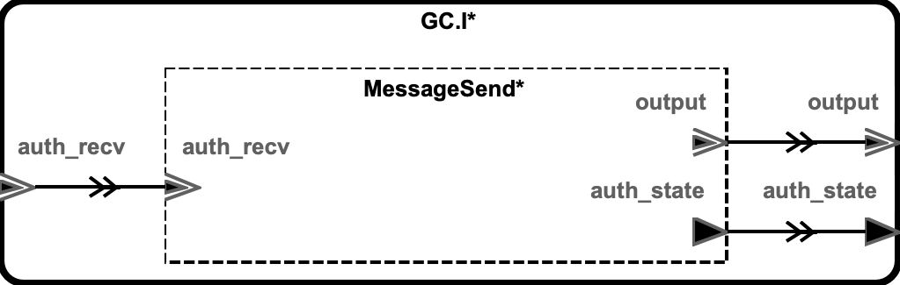
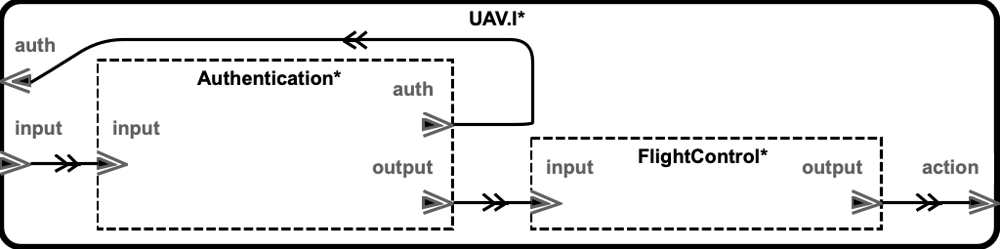
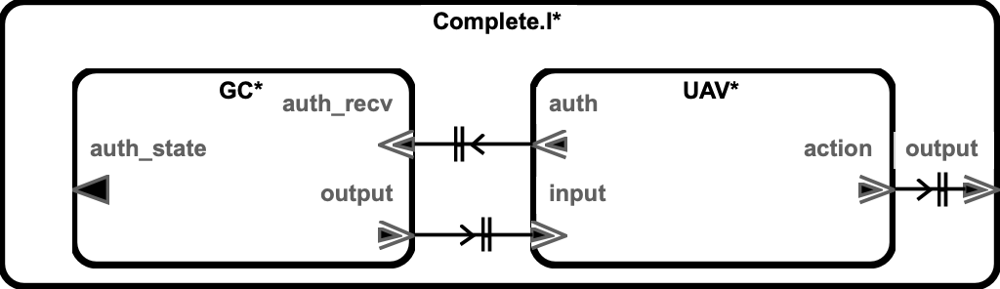

So You Want To Talk About Authentication
========================================

Goal
----

Authentication is necessarily a multiparty exercise. The trivial approach would
be to create two components, a message sender and a message receiver, where the
receiver only performs some action if some function of the sender's message
evaluates to true. This is a simple filter and would be easy enough to
implement.

Instead, we want to provide a more realistic example. A specific bidirectional
message exchange (a handshake, of sorts) must take place in order for the
message sender (in this case, a ground control station) to authenticate
successfully with the receiver (a UAV) and begin to have the receiver obey
commands.

Caveat: this system is somewhat simplistic, and is not meant to model
exceptionally secure authentication procedures, or e.g. a process even as
complex as the SSH handshake. Its goal is moreso to demonstrate guarantees of
message authenticity, login as a blocking process, and how state can be
reflected across two separate components. There are certainly parallels between
it and `stateful`.

The System
----------

In a nutshell:

```txt
    GCS                     UAV
+--------+              +--------+
|        |              |        |
|        |--- LOGIN --->|        |
|        |              |        |
|        |              |        |
|        |<--- AUTH ----|        |
|        |              |        |
|        |              |        |
|        |- TURN_LEFT ->|   OK   | // i.e. obeyed
|        |              |        |
|        |              |        |
|        |- TURN_RIGHT->|   OK   |
|        |              |        |
+--------+              +--------+
```

or

```txt
    GCS                     UAV
+--------+              +--------+
|        |              |        |
|        |--- LOGIN --->|        |
|        |              |        |
|        |              |        |
|        |<-- UNAUTH ---|        |
|        |              |        |
|        |              |        |
|        |- TURN_LEFT ->|    X   | // i.e. ignored
|        |              |        |
|        |              |        |
|        |- TURN_RIGHT->|    X   |
|        |              |        |
+--------+              +--------+
```

As a technical note, the connections that allow `GC` and `UAV` to send and
receive messages are described in AADL as `Delayed`, meaning a command sent from
one in one time step will not be received by the other until the next time
step. This is specified in `complete.aadl`:

```aadl
properties
	Communication_Properties::Timing => Delayed
		applies to C0, C1, C2;
```

However, the same is not true of the internal connections in `GC` or `UAV`. This
means that either can receive and send a message in the same time step. I'm not
sure this is necessary, but it made it easier for me to reason about the state
transitions and their timing.

Verifying the Model
-------------------

Open `complete.aadl` and click into `Complete.I`. Right-click and select
`AGREE > Verify All Layers` to see that the guarantees hold, for `Complete` as
well as the chosen implementations of `GC` and `UAV`. Unlike other examples in
this repo, there's non-obvious bug to fix before verifying.

Running the Example Code
------------------------

Executing `make run` at the shell within `authentication` will run both the
simulated UAV and ground control station. Whether the signin key is correct (for
illustration purposes) is a random 1 in 2 chance.

Safety Properties
-----------------

No particular AGREE statement epitomizes the properties we'd like for the system
to have, but a few stand out:

```text
guarantee "Authorized bit set when in AUTH" :
	output.authorized <=> auth_state = AUTH;
```

`GC` has an internal state variable whose behavior is guaranteed in `GC`'s
top-level AGREE annex. We say here that the only way for the ground control
system to send an "authorized" message is if its internal state is AUTH.

We specify that state's transition rules somewhat piecemeal:

```text
guarantee "UNAUTH to begin with" :
	(auth_state = UNAUTH) -> true;

guarantee "UNAUTH transitions to WAITING or UNAUTH" :
	pre(auth_state = UNAUTH) => ((auth_state = UNAUTH) or (auth_state = WAITING));

guarantee "WAITING transitions to UNAUTH or AUTH" :
	pre(auth_state = WAITING) => ((auth_state = UNAUTH) or (auth_state = AUTH));
```

These are simple state transition rules with no dependence on interparty
communication. For that, we have this guarantee:

```text
property auth_received = AGREE_PLTL::Once((event(auth_recv) and auth_recv = AUTH));
property auth_received_after_login = auth_received and
                                     pre(AGREE_PLTL::Once(event(output) and
                                     	                  output.command = LOGIN));
guarantee "AUTH reached internally if AUTH received after LOGIN sent" :
	(auth_state = AUTH) => auth_received_after_login;
```

This provides a meatier restriction: in order for `AUTH` to be achieved
internally, we must have a) sent `LOGIN` and b) received authorization sometime
_after_ that `LOGIN`. This places a temporal and communication-based restriction
on the state machine we use to represent internal authentication state. That, in
tandem with `"Authorized bit set when in AUTH"`, grants us a meaningful (if
uncomplicated) notion of authentication.

In reality, you might imagine the ground control station as a sort of a
terminal: if a bad actor gains access, but lacks the appropriate key/password,
they would be unable to cause authorized messages to be sent without first
logging in, and therefore (assuming the UAV responds appropriately to login
attempts) unable to cause authorized messages to be sent at all.

The latter assumption deserves examination; we guarantee it in `UAV` and its
subcomponent `Authentication`.

In `UAV`:

```text
guarantee "Responds only to LOGIN messages" : if event(input) and input.command = LOGIN
	then event(auth) and (auth = UNAUTH or auth = AUTH)
	else not event(auth);
```

In `Authentication`:

```text
property good_login = event(input) and
                      input.command = Types::LOGIN and
					  authenticate(input.key);
property bad_login  = event(input) and
                      input.command = Types::LOGIN and
					  not authenticate(input.key);
guarantee "AUTH sent iff good LOGIN received" :
	if good_login
	then event(auth) and auth = AUTH
	else

	if bad_login
	then event(auth) and auth = UNAUTH
	else

	not event(auth);
```

`authenticate` here is a trivial function meant to take the place of what could
be a more involved AADL/AGREE specification of authentication behavior - an
interesting problem but beyond the intended scope of this example.

`UAV`'s guarantee is high-level: if someone tries to authenticate, it will
respond with one of two messages. `Authentication`'s guarantee is more granular:
if the provided key satisfies some function `authenticate` (in this example, a
trivial function, but could be replaced with a more sophisticated AADL/AGREE
representation of authentication), authority will be granted. If not, not.

As AGREE is based on using assumes and guarantees in subcomponents to prove
things about components that contain them, it's necessary that at some point in
the chain the guarantees made will be based on nothing at all and will be
treated as vacuously true (if consistent). Those points in this example are in
`MessageSend` and `Authenticate`; anything we guarantee there is based on human
logic rather than smaller sub-guarantees. As such, those guarantees are meant to
be on the simpler side.

Diagrams
--------

The ground control system:



The inner MessageSend component appears redundant, but is necessary in order to
make meaningful guarantees at the GC level.

The UAV:



Both in tandem:



The unconnected `auth_state` port is the external-facing representation of
internal state. It does not need to be connected to anything.

Miscellaneous
-------------

In the process of doing this, it became clear that AGREE cannot easily handle
bidirectional assume/guarantee relationships. In other words, the following will
fail to verify:

```aadl
with Base_Types;

system A
    features
        input  : in  event data port Base_Types::Natural;
        output : out event data port Base_Types::Natural;

    annex agree {**
        assume "A input is 1" : input = 1;
        guarantee "A output is 0" : output = 0;
    **};
end A;

system B
    features
        input  : in  event data port Base_Types::Natural;
        output : out event data port Base_Types::Natural;

    annex agree {**
        assume "B input is 0" : input = 0;
        guarantee "B output is 1" : output = 1;
    **};
end B;

system C
    annex agree {**
        -- Here just to make AGREE reason about C's subcomponents
    **};
end C;

system implementation C.I
    subcomponents
        A : system A;
        B : system B;

    connections
        a2b : port A.output -> B.input;
        b2a : port B.output -> A.input;
end C.I;
```

However, making the connection timing `Delayed` rather than `Immediate` and
assuming an initial good state resolves this issue, like so:

```aadl
system A
    features
        input : in event data port Base_Types::Natural;
        output : out event data port Base_Types::Natural;

    annex agree {**
        assume "A input" : true -> input = 3;
        --                 ^ assume initial state is good
        guarantee "A output" : output = 4;
    **};
end A;


system B
    features
        input : in event data port Base_Types::Natural;
        output : out event data port Base_Types::Natural;

    annex agree {**
        assume "B input" : true -> input = 4;
        --                 ^ assume initial state is good
        guarantee "B output" : output = 3;
    **};
end B;


system C
    annex agree {**
        -- Here just to make AGREE reason about C's subcomponents
    **};
end C;

system implementation C.I
    subcomponents
        A : system A;
        B : system B;

    connections
        a2b : port A.output -> B.input;
        b2a : port B.output -> A.input;

    properties
        Communication_Properties::Timing => Delayed applies to a2b, b2a;
        -- ^ Far end updated at next time step
end C.I;
```

In practice, this means `GC` makes no assumptions about `UAV`'s output, while
`UAV` does make assumptions about `GC`'s output. The model probably could have
been made to work the other way as welln
