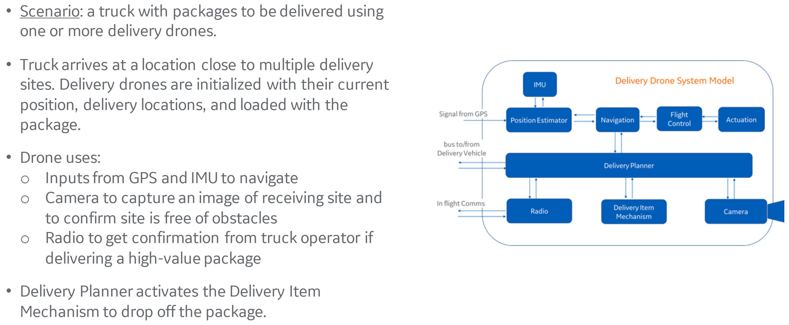
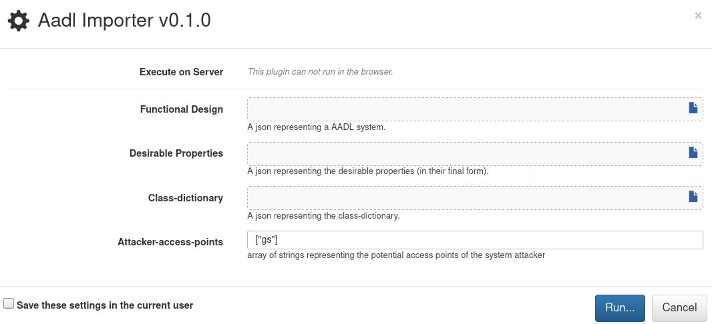
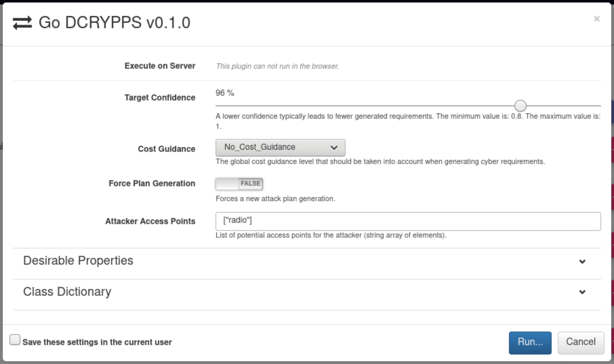
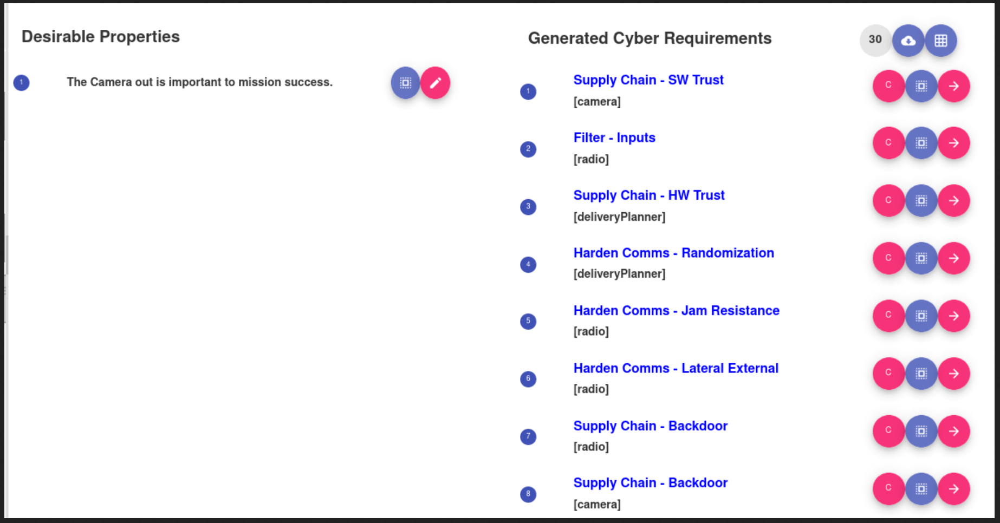
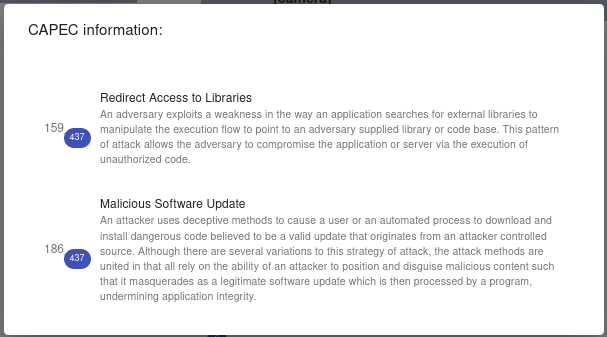

DCRYPPS Tutorial
================

The Architectural Model
-----------------------

For this example, we will model a delivery drone that uses the
guidance, navigation and control (GNC) system described earlier.
The drone system is intended to be a part of a delivery operation which consists
of a van with packages to be delivered and one or more delivery drones. After
the van arrives at a location that is close to multiple delivery sites,
the delivery drones are initialized with their current position,
delivery location, and the package to be delivered is loaded up.
After a delivery drone is launched, it uses the inputs from the GPS and IMU
to navigate to the delivery location. When the drone reaches the delivery location,
it uses its Camera to capture an image of the receiving site to confirm that
it is free of obstacles and it is safe for the package to be dropped off.
For a high-value package, the Delivery Planner will use the Radio to get
confirmation from the operator in the van. If there are no obstacles on the
receiving site and confirmation (if needed) is received from the operator,
then the Delivery Planner will activate the Delivery Item Mechanism to drop off
the package. The Delivery Drone also needs to avoid certain locations and airspace,
for example airports, schools and government buildings. A visual representation of
system is below.



The full AADL definition of this system can be found in the `aadl-model` package.

The DCRYPPS Model
-----------------

To make the AADL model consumable by DCRYPPS, we need to generate
a JSON-based representation of it. To do this, open
the AADL model in an OSATE environment[^1] that has the Collins BriefCASE
plugin installed. Then select the DeliveryDroneSystem implementation icon -
 in the
`Outline` pane and click the `Export to JSON` button in the OSATE toolbar[^2].
This will create a `json-generated` folder in the project containing a
`DeliveryDrone.json` model that can be used with DCRYPPS. For all intents and
purposes, the generated JSON data mirrors what is captured in the AADL model.
For instance, the `Radio` component is represented in AADL as

```aadl
system Radio
	features
		-- inputs
		comm_in: in data port Data_Types::RadioResponse.impl;
		radio_in: in data port Base_Types::Boolean;

		-- outputs
		comm_out: out data port Base_Types::Boolean;
		radio_out: out data port Data_Types::RadioResponse.impl;
		health_status: out data port Base_Types::Boolean;
end Radio;
```

and its JSON translation is the following.

```aadl
{
	"name": "DeliveryDrone::Radio",
	"localName": "Radio",
	"kind": "ComponentType",
	"category": "system",
	"features": [
	{
		"name": "comm_in",
		"kind": "DataPort",
		"classifier": "Data_Types::RadioResponse.impl",
		"direction": "in"
	},
	{
		"name": "radio_in",
		"kind": "DataPort",
		"classifier": "Base_Types::Boolean",
		"direction": "in"
	},
	{
		"name": "comm_out",
		"kind": "DataPort",
		"classifier": "Base_Types::Boolean",
		"direction": "out"
	},
	{
		"name": "radio_out",
		"kind": "DataPort",
		"classifier": "Data_Types::RadioResponse.impl",
		"direction": "out"
	},
	{
		"name": "health_status",
		"kind": "DataPort",
		"classifier": "Base_Types::Boolean",
		"direction": "out"
	}
}
```

In addition to the base architectural model, DCRYPPS requires defining several
additional components for the model. Each of these is described in detail below.

### Desirable Properties

In DCRYPPS, there are a set of top-level requirements for the system to
successfully execute its mission. These are called the desirable properties.
When DCRYPPS analyzes a model, it attempts to negate these
desirable properties, generating a series of attack plans that disrupt the mission.
Currently, DCRYPPS represents the desirable properties as a single JSON file
containing the desirable properties of the system being modeled. An example
desirable properties file is shown below.

```json
[
  {
    "property-number": "1",
    "property-type": "temporal",
    "property-name": "important",
    "attribute": "camera.camera_out",
    "description": "The Camera out is important to mission success."
  }
]
```

A complete description of this file format can be found in the
DCRYPPS documentation.

### Class Dictionary

The Class Dictionary is a JSON dictionary that specifies the mappings of
component names in the current model to the semantic component names
recognized by DCRYPPS. Note that only a subset of the component
names need to be mapped to DCRYPPS concepts (i.e., some won't have relevant mappings).
The purpose of the class dictionary is to allow the model designer to define
components in their domain-specific vocabulary of component types while preserving the
ability to define mappings into the relevant DCRYPPS concepts.

This characterization of the kind of components in the model enables the
attack plan generator and the subsequent requirements generation to reason about how the
objects may be attacked. The class dictionary is a simple JSON file where each key is a top-level
DCRYPPS component type, and the value is a JSON vector of strings, where each string is a
component type name that is semantically equivalent to the top-level DCRYPPS component type.
The currently defined keys in the class dictionary are `"ExternalConnections"`,
`"InternalConnections"`, `"NavigationalSensor"`, `"NavigationalSensorNotDependentOnRadio"`,
`"Workstation"`, `"Router"`, `"SmartController"`, `"SmartCamera"` and `"SmartRadio"`. A 
complete description of the component types is included in the DCRYPPS documentation.
An example class dictionary for the delivery drone is given below.

```json
{ "ExternalConnections":
  ["Radio"],

  "InternalConnections" :
  [ "Bus", "bus", "Connector"],

  "NavigationalSensor":
  ["GPS"],

  "NavigationalSensorNotDependentOnRadio":
  ["IMU"],

  "SmartController":
  ["DeliveryPlanner"],

  "SmartCamera":
  ["Camera"],

  "SmartRadio":
  ["Radio"]
}
```

### Attacker Access Points

The attacker access points are the components in the model from which an attacker can gain a
foothold into the system. Access points are currently expressed as a single component
or bus in the model. The access point in the delivery drone example is specified as `["radio"]`.

The full DCRYPPS model including the JSON-based architectural design, desirable
properties, class dictionary and attacker access points can
be found in the `dcrypps-model` package.

Importing models into DCRYPPS
-----------------------------

DCRYPPS is run via a collection of docker containers. Launch the
containers using the `start_dcrypps.sh` script and then visit
`http://localhost:8888` from a web browser. This will open the WebGME interface.
To import the DCRYPPS delivery drone model into WebGME,
select the `ROOT` of the AADL project and click the play button in the
upper left hand corner. Then select `Aadl importer` to open a dialog like the one below.



We can import our delivery drone example by supplying references to the model files we defined
in the previous section (in the `dcrypps-model` package).

Running DCRYPPS
---------------

Once the model is imported, double click on `DeliveryDrone` folder in the `Object Browser`
pane on the right. On the right hand side of the project explorer, click on `Run DCRYPPS`.
This will open a dialog like the one below.



Since our model is already configured, simply select `Run`. After DCRYPPS runs, it will display
the generated cyber requirements as shown below.



DCRYPPS checks for a fixed set of cyber requirements. The full list of these
requirements can be found in the documentation. In the delivery drone example,
the first requirement `Supply Chain - SW Trust` applies to the `deliveryPlanner`
component in the drone system implementation. Clicking the `C` icon for the
requirement gives the full details for the vulnerability class, as shown below.



The full list of generated cyber requirements for the delivery drone example
can be found in the `requirements` package.

[^1]: To launch OSATE and DCRYPPS in the VM, refer to [QUICKSTART](/vm/docs/QUICKSTART.md)

[^2]: There is a known bug in which DCRYPPS and OSATE may enter a state which prevents
exporting to JSON. If you encounter this bug, when you click the `Export to JSON`, you will
see an error pop-up that reads `Unable to export model to JSON format`, as well as the
message `java.lang.NullPointerException` in the OSATE console. To fix this error, you will
need to quit OSATE, delete the directory `/home/aadl/Tools/Osate/workspace/.metadata` (or
the equivalent file if you are using a custom workspace location), and start OSATE again.
Any projects you had open in OSATE will no longer be open, but they will still be present on
disk, so you may simply re-import them.
