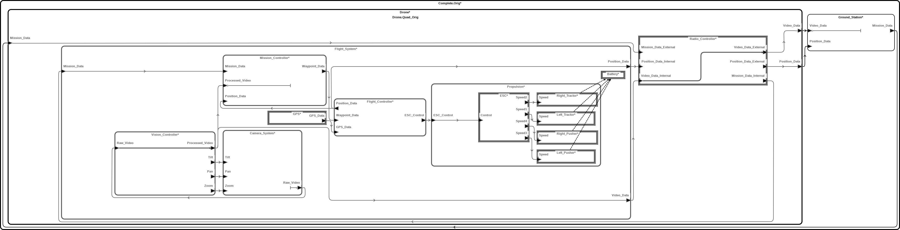
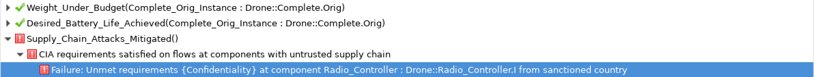
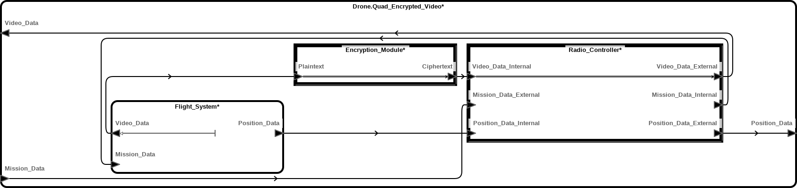

Resolute Tutorial
====================================================================================

Goal
----

Express and verify non-functional requirements of a camera drone system,
including ensuring that:

* the combined weight of all components on-board the drone comes in under a
  weight budget;
* the drone achieves a given battery life based on constant draw from the
  components it powers; and
* security requirements are met on the drone's internal data connections.

Resolute
--------

The *Resolute* AADL extension allows users to make and verify assertions about
the structure of a model using a domain-specific language. AADL system
implementations can contain *Resolute* annex blocks with `prove(Req())` clauses,
where `Req()` is a boolean-valued claim function, defined in a global resolute
annex block. The language for defining requirements includes built-in functions
for quantifying over the components or features of a model or system, or over a
component's properties, flows, etc. A full reference can be found
[here](https://github.com/loonwerks/formal-methods-workbench/blob/master/documentation/resolute/reference.pdf).

In general, the properties we can verify with *Resolute* are things that could
easily be checked by hand on small models. The benefit of using *Resolute* is
scalability. As our model gets larger, doing these checks by hand gets more
time-consuming and error-prone. Moreover, we potentially need to repeat them
every time we make a change to our model. *Resolute* automates this process for
us.

The Model
---------



In this example, we consider an autonomous camera-drone system (`Drone`),
connected to a ground station (`Ground_Station`) via a radio connection. The
drone accepts mission commands from the ground station (where to go and what
objects to track visually, for example) and sends back position and video data.
Communication with the ground station is via a radio controller device
(`Radio_Controller`). Note that the `Radio_Controller` has a separate feature
for each kind of data sent to or from the ground station. This will be important
later for letting us reason about the security requirements on each of these
data flows individually.

Internally, the drone has three primary computational components. The
`Mission_Controller` processes mission commands from the ground station as well
as position data from the `Flight_Controller` and video tracking data from the
`Video_Controller`. Based on this information, it sends waypoints to the
`Flight_Controller` for navigation. The `Flight_Controller` processes waypoint
data from the `Mission_Controller` and sensor data, and using this information
provides input to the propellers. Finally, the `Vision_Controller` controls the
actuators on the `Camera_System` and processes the resulting video, providing
tracking data to the `Mission_Controller`.

The model additionally has a `Propulsion_System`, with an Electronic Speed
Controller (ESC) controlling four propellers, a `Camera_System`, with a camera
sensor that sends video back to the `Vision_Controller`, and a GPS sensor,
attached to the `Flight_Controller`. We assume that the `Flight_Controller` has
a built-in Inertial Measurement Unit (IMU).

Simple Compositional Properties: Weight Budget
----------------------------------------------

Perhaps the simplest task for which *Resolute* is used is checking some static
requirement on the combined properties of all components of a model or system.
In this case, we would like to ensure that the total weight of our drone is
below some threshold, determined by the thrust of our propellers. Although there
may be (non-cyber-physical) parts of the drone that are not represented by our
model, such as the frame, we can assume that these will not be changed over the
course of designing the cyber-physical systems, and factor them into our weight
budget.

Our first task is to define appropriate properties for the components of our
model in a property set. In `Physics.aadl`, we define a unit of weight, along
with the properties `Weight`, indicating the weight a component adds to the
system, and `Weight_Budget`, indicating the maximum desired weight of the
subcomponents of a system.

```aadl
Weight_Units: type units (g, kg => g * 1000);

Weight: aadlreal units Physics::Weight_Units applies to (device, system,
                                                         processor, memory, bus);
Weight_Budget: aadlreal units Physics::Weight_Units applies to (system);
```

The `Weight_Units` type declaration permits us to specify the `Weight` of
components in grams or kilograms. *Resolute* extracts this property from a
component `c`, by calling the `has_property(c, Physics::Weight)` and
`property(c, Physics::Weight)` built-in functions. The result of calling
`property(c, Physics::Weight)` will always be in the smallest of the units
defined (so grams, in this case). Another thing to be aware of is that calling
`property(c, Physics::Weight)` on a component that does not have `Weight`
defined will result in the claim function failing, so unless we want those
semantics, one must guard such a call to with a `has_property(c,
Physics::Weight)` check first.

Once we have annotated our drone system with a `Weight_Budget` and its
components with their `Weight`, we next need to write the *Resolute* code that
will check the weight budget of our system against the combined weight of its
components. Best practice is to place the definitions of *Resolute* requirements
and functions in a *Resolute* annex block within a separate package and add this
package to a `with` block in the package we want to use it in. We will use the
file `Resolute_Functions.aadl` for this purpose.

```aadl
package Resolute_Functions
public
    with Resolute_Helpers;

    annex resolute {**
        -- Resolute function and requirement definitions go here.
    **};
end Resolute_Functions;
```

We start by writing a *Resolute* function to retrieve the weight of a component.
Getting the `Weight` property of a component is easy. But we don't want to
define a `Weight` on every component instance in our system, since some of these
may be composite components whose weight depends on the weight of its
subcomponents. Hence, the procedure we will use is as follows, given a component
as input:

1. Check whether the component has a `Weight` defined on it. If so, use that.
2. Otherwise, sum the weights (recursively) of the system's subcomponents and
   return it.

```resolute
-- Weight of a (possibly composed) component in grams
weight(c: component): real =
    if has_property(c, Physics::Weight)
        then property(c, Physics::Weight)
        else realsum([weight(s) for (s: subcomponents(c))])
```

Next we write a claim function verifying that the combined weight of a system is
less than its `Weight_Budget`. A claim function looks a bit like a normal
function syntactically, except that (a) it lacks a return value, and (b) it has
a description string before its body. The return type is always implicitly
`bool`. The description string is delimited by `**`, and will be displayed when
verifying the claim. It may contain variables, such as `s` in the claim function
below, whose names will be printed.

```resolute
Weight_Under_Budget(s: system) <=
    ** s " meets weight budget" **
    weight(s) <= property(s, Physics::Weight_Budget)
```

Finally, we add the claim function to our model. Claim functions can be added
components at any level of our model, but here we restrict ourselves to placing
them in the top-level system implementation.

```aadl
system implementation Complete.Orig
    subcomponents
        Ground_Station: system Ground_Station;
        Drone: system Drone.Quad_Orig;

    ...

    annex resolute {**
        prove(Weight_Under_Budget(this.Drone))
    **};
end Complete.Orig;
```

A More Complex Compositional Property: Power Budget
---------------------------------------------------

Based on the combined weight of our drone, the maximum charge of our battery,
and the current or power draw of the components connected to the battery, we can
determine our drone's battery life. Ensuring that we do not place so much load
on the battery that we fall below a given battery-life threshold is another
property we can test using *Resolute*.

This will be more complex than simply summing weights for a couple of reasons.
First, we need to be able to do some math in *Resolute* to calculate battery life
based on a combined current draw. Second, we must have a way to indicate that a
component uses a particular power source, and to find all the components that
use a power source in *Resolute*. Once again, the first step is to define some
power-related properties that we can define on our model for *Resolute* to
extract.

```aadl
Current_Draw: aadlreal units Physics::Current_Units applies to (device, system, processor);
Power_Draw: aadlreal units Physics::Power_Units applies to (device, system, processor);

Max_Charge: aadlreal units Physics::Charge_Units applies to (device, system);
Nominal_Output_Voltage: aadlreal units Physics::Voltage_Units applies to (device, system);
Desired_Battery_Life: aadlreal units Physics::Time_Units applies to (device, system);

Power_Source: reference applies to (device, system, processor);
```

The `Current_Draw` property, in base units of mA, will be used to annotate the
draw of components like the propellers, which use the full output voltage of the
power source. Meanwhile, the `Power_Draw` property, in base units of mW, can be
used for components that have been stepped down to, say, a standard 5 volts. The
`Power_Source` property is a reference to the component instance to be used as
another component's power source. The `Nominal_Output_Voltage` property, applied
to the power source allows us to convert `Current_Draw` to `Power_Draw`.
Finally, we place a `Desired_Battery_Life` on the power source, which our
*Resolute* code will check against. Annotating components with these properties
looks like this:

```aadl
    system implementation Flight_System.I
        subcomponents

            ...

            Propulsion: system Propulsion.Quad;
            Battery: device Battery.Zeee_6S_Lipo;

            ...

        properties
            -- Attach the propellers in the propulsion system to the battery.
			Physics::Power_Source => reference(Battery) applies to
				Propulsion.Left_Tractor, Propulsion.Right_Tractor, Propulsion.Left_Pusher,
				Propulsion.Right_Pusher;
	end Flight_System.I;

	system implementation Propulsion.Quad
		subcomponents
			ESC: device ESC.Hobbywing_200A;

			Left_Tractor: device Propeller.Five33_Headsup_2207_5x4x3;
			Left_Pusher: device Propeller.Five33_Headsup_2207_5x4x3;

			Right_Tractor: device Propeller.Five33_Headsup_2207_5x4x3;
			Right_Pusher: device Propeller.Five33_Headsup_2207_5x4x3;

            ...

    end Propulsion.Quad;

    device implementation Propeller.Five33_Headsup_2207_5x4x3
		-- From https://www.miniquadtestbench.com/assets/components
                                                /motordata/motorinfo.php?uid=287
		properties
			Physics::Current_Draw => 23.88 A; -- Current at 75% thrust (1336 g)
	end Propeller.Five33_Headsup_2207_5x4x3;

    device implementation Battery.Zeee_6S_Lipo
        properties
            -- Based a pair of Zeee 6S Lipos wired in parallel:
            -- https://www.amazon.com/dp/B07ZV5DDWQ
            Physics::Max_Charge => 12000.0 mAh;
            Physics::Nominal_Output_Voltage => 22.2 V;
            Physics::Desired_Battery_Life => 0.1 hr;
    end Battery.Zeee_6S_Lipo;
```

The claim function for this property looks very similar to the one we used for
calculating weight budget. Notice though, the `orelse fail ...` after our
boolean test. The `orelse` operator is a short-circuited disjunction, so the
`fail` is evaluated only if the test is false, causing the claim to fail with a
useful message.

```resolute
-- Checks that the batery life of the component bat is at least the
-- desired battery life
Desired_Battery_Life_Achieved(bat: device) <=
    ** bat " achieve desired battery life" **
    let desired: real = property(bat, Physics::Desired_Battery_Life);
    let actual: real = battery_life(bat);
    actual >= desired
        orelse fail ** bat " has battery life " actual " hr, but " desired " hr is desired" **
```

Calculating the total battery life of a power source is as simple as multiplying
the `Max_Charge` in mAh by the `Nominal_Output_Voltage` in volts to get the
power capacity in mWh, and then dividing by the total power draw in mW. In order
to calculate the total power draw, though, we need to be able to find all
components that are connected to this power source. The sum in the definition of
`W` below is over a list comprehension that selects every component in the model
(`... for (l: component)`) with a `Power_Source` property equal to the given
component.

```resolute
-- Return true iff s is the power source of c
is_power_source_of(c: component, s: component): bool =
    has_property(c, Physics::Power_Source) and property(c, Physics::Power_Source) = s

-- Battery life of power source c in hours, based on the power draw of
-- the components attached to it
battery_life(c: component): real =
    let V: real = property(c, Physics::Nominal_Output_Voltage);
    let Ih: real = property(c, Physics::Max_Charge);
    let W: real = realsum([power_draw(l) for (l: component) | is_power_source_of(l, c)]);
    (V * Ih) / W
```

Finally, we add a `prove` block to the top-level system, as before:

```aadl
system implementation Complete.Orig
    subcomponents
        Ground_Station: system Ground_Station;
        Drone: system Drone.Quad_Orig;

    ...

    annex resolute {**
        prove(Desired_Battery_Life_Achieved(this.Drone.Flight_System.Battery))
    **};
end Complete.Orig;
```

Verifying Structural Properties: Potential Supply-Chain Attacks
---------------------------------------------------------------

The last property we will verify using *Resolute* is that sensitive data does
not pass unprotected into components we don't trust, due to the potential for
supply-chain attacks. In particular, we will assign each component a
"provenance" (in this case, just a country of origin). We will also define
several flows of data through our model, declaring the kinds of security
assurance required and/or provided at each outgoing port on a component
(confidentiality, integrity, availability). We would like to ensure that all
required assurances are satisfied each time we reach a component we think might
be vulnerable to supply-chain attacks, due to its provenance.

Once again, the first step is to define some properties with which to annotate
our model, this time having to do with supply-chain and security assurances. The
`Country` type is an enumeration of countries (non-exhaustive, in the interest
of space). The `Provenance` property lets us annotate components with their
country or countries of origin. And `Sanctioned_Countries` is a constant list of
provenances that may indicate a component is vulnerable to supply-chain attack.
In addition, we create properties that indicate that a security assurance is
required or provided by a feature.

```aadl
Country: type enumeration (USA, France, Germany, China, Singapore, India, North_Korea,
                           South_Korea, Saudi_Arabia, Afghanistan);

Sanctioned_Countries: list of Supply_Chain::Country => (North_Korea) applies to (all);

Provenance: list of Supply_Chain::Country => () applies to (all);

CIA: type enumeration (Confidentiality, Integrity, Availability);

Required_Assurances: list of Supply_Chain::CIA => () applies to (feature);
Provided_Assurances: list of Supply_Chain::CIA => () applies to (feature);
```

We annotate our model with these properties, as well as adding data flows as
follows:

```aadl
system Camera_System
	features
		Raw_Video: out data port {Supply_Chain::Required_Assurances => (Confidentiality);};

		...

end Camera_System;

	device Radio_Controller
	features
	  Mission_Data_External: in data port;
	  Mission_Data_Internal: out data port;

	  Video_Data_Internal: in data port;
	  Video_Data_External: out data port {
        Supply_Chain::Provided_Assurances => (Confidentiality);
      };

	  Position_Data_Internal: in data port;
	  Position_Data_External: out data port {
        Supply_Chain::Provided_Assurances => (Confidentiality);
      };

		...

end Radio_Controller;

system implementation Drone.Quad_Orig

	...

	flows
	  Video_Source: flow source Flight_System.Video_Source -> Video_Data_Internal
								-> Radio_Controller.Video_Flow -> Video_Data_External
                                -> Video_Data;
end Drone.Quad_Orig;
```

Checking this property is somewhat more involved than our last examples because
we need to iterate through each flow defined in our model and maintain a
collection of which assurances are currently unsatisfied. The
`check_cia_on_supply_chain` function may look a little daunting, but all it does
is recursively examine each connection in a sorted AADL flow, adding
`Provided_Assurance` and `Required_Assurance` properties to a set. When a
component from a sanctioned country is encountered, it checks that the set is
empty, failing with a descriptive error message otherwise.

```resolute
-- Process connections in order, keeping track of unmet assurance
-- requirements, ensuring that all requirements are met if a component
-- from a sanctioned country is encountered.
check_cia_on_supply_chain(cs: [connection]): bool =
    check_cia_on_supply_chain_rec({}, cs)

-- Helper for the above.
check_cia_on_supply_chain_rec(prev_reqs: {string}, cs: [connection]): bool =
    if length(cs) = 0 then true else
      let cur_conn: connection = head(cs);
      let src_comp: aadl = parent(source(cur_conn));
      let dst_comp: aadl = parent(destination(cur_conn));
      let new_prvs: {string} = as_set(property(source(cur_conn),
                                      Supply_Chain::Provided_Assurances));
      let new_reqs: {string} = as_set(property(source(cur_conn),
                                      Supply_Chain::Required_Assurances));
      let cur_reqs: {string} = { r for (r: union(prev_reqs, new_reqs))
                               | forall (p: new_prvs). r <> p };
      if component_is_from_sanctioned_country(dst_comp) and length(cur_reqs) > 0
          then fail ** "Unmet requirements " cur_reqs " at component " dst_comp
          " from sanctioned country" ** else check_cia_on_supply_chain_rec(cur_reqs, tail(cs))
```

The claim merely examines every `end_to_end flow` in the model and runs
`check_cia_on_supply_chain` on it, succeeding if the check passes on all of
them. Note that this claim takes no arguments, meaning that it is a claim on the
entire model, rather than a specific component.

```resolute
Supply_Chain_Attacks_Mitigated() <=
    ** "CIA requirements satisfied on flows at components with untrusted supply chain" **
    forall (f: end_to_end_flow). check_cia_on_supply_chain(sorted_flow_connections(f))
```

As always, the last step is to add a `prove` statement to the top-level system
implementation of our model.

```aadl
system implementation Complete.Orig

    ...

    annex resolute {**
        prove(Supply_Chain_Attacks_Mitigated())
    **};
end Complete.Orig;
```

Running Resolute
----------------

To run *Resolute*, put your cursor inside of the component where the *Resolute*
`prove` blocks appear and click the Resolute button: . Doing so on our model, we discover that our
supply-chain test fails:



The output tells us that our `Radio_Controller` receives video data that
requires confidentiality assurances from the `Camera_System`, but it is from a
sanctioned country. Notice that the `Radio_Controller` provides confidentiality
assurances on *outgoing* video data, but this is not sufficient since here our
concern is about the `Radio_Controller` *itself* viewing confidential data.

```aadl
device Radio_Controller
    features

        ...

        Video_Data_Internal: in data port;
        Video_Data_External: out data port {
          Supply_Chain::Provided_Assurances => (Confidentiality);
        };

        ...

    flows
        Video_Flow: flow path Video_Data_Internal -> Video_Data_External;
end Radio_Controller;

device implementation Radio_Controller.I
    properties
        Supply_Chain::Provenance => (North_Korea);

        ...

end Radio_Controller.I;

system Camera_System
    features
        Raw_Video: out data port {
          Supply_Chain::Required_Assurances => (Confidentiality);
        };

        ...

end Camera_System;
```

One obvious way to fix this problem would be to replace the `Radio_Controller`
with one that wasn't made in North Korea. But assuming this isn't an option, we
can also add a module that encrypts our video data before it reaches the
`Radio_Controller`.



```aadl
system implementation Drone.Quad_Encrypted_Video
    subcomponents
        Flight_System: system Flight_System.I;
        Encryption_Module: device Encryption_Module.I;
                            -- Added to encrypt video before Radio_Controller
        Radio_Controller: device Radio_Controller.I;
    connections
        Video_Data_External: port Radio_Controller.Video_Data_External
                                    -> Video_Data;
        Video_Data_Internal_Unencrypted: port Flight_System.Video_Data
                                    -> Encryption_Module.Plaintext;
        Video_Data_Internal_Encrypted: port Encryption_Module.Ciphertext
                                    -> Radio_Controller.Video_Data_Internal;

        ...

    flows
        Video_Source: flow source Flight_System.Video_Source
                                -> Video_Data_Internal_Unencrypted
                                -> Encryption_Module.Encrypt
                                -> Video_Data_Internal_Encrypted
                                -> Radio_Controller.Video_Flow
                                -> Video_Data_External
                                -> Video_Data;
end Drone.Quad_Encrypted_Video;

device Encryption_Module
    features
        Plaintext: in data port;
        Ciphertext: out data port {
          Supply_Chain::Provided_Assurances => (Confidentiality);
        };
    flows
        Encrypt: flow path Plaintext -> Ciphertext;
end Encryption_Module;
```

Running *Resolute* again shows that all claims now pass.
