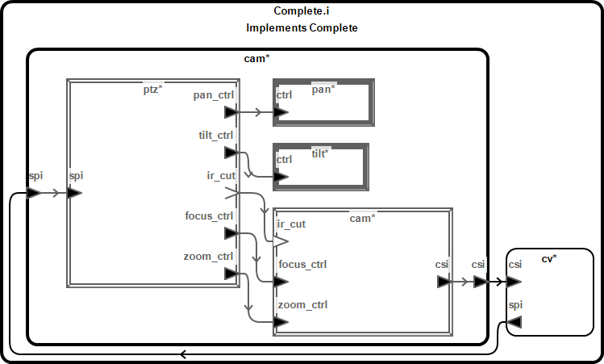
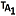
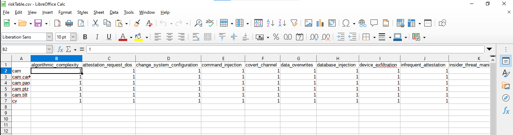
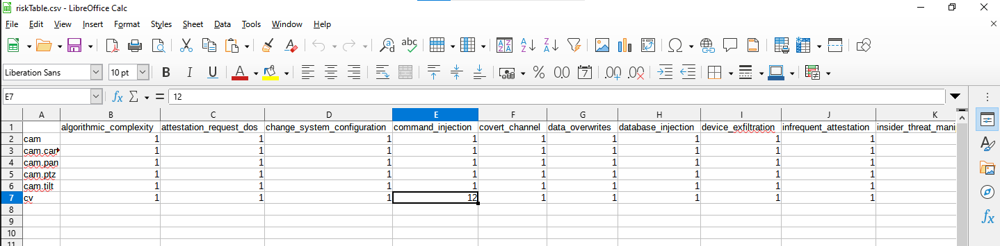
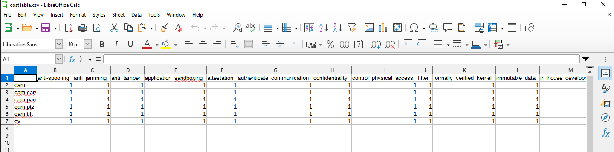
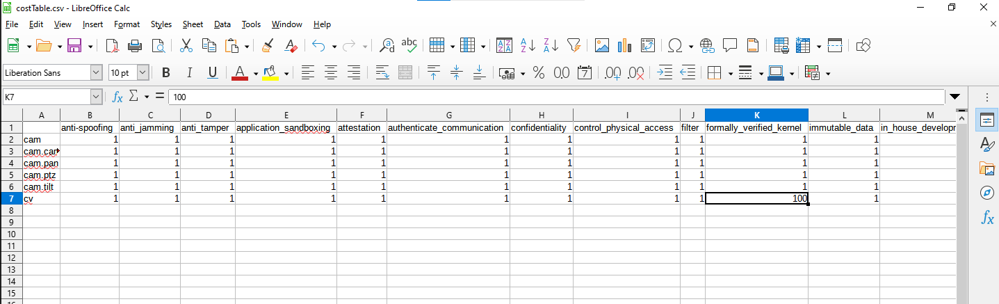

GearCASE Tutorial: Camera Example
=================================

In this example, we demonstrate using GearCASE to evaluate security requirements
for a tracking-camera system. The model we will use is forked from
[this model](https://gitlab-ext.galois.com/aadl/camera) of an actual
software/hardware system designed as part of the CASE project.

Given our model, GearCASE will generate a set of attack plans based on a variety
of cybersecurity metrics including Common Weakness Enumerations (CWEs). In
addition, it will generate a set of requirements that can be used to mitigate
those attacks. Some attacks may be more damaging than others, and some
components more in need of protection, depending on the intent of the system
under evaluation. Furthermore, some mitigations may be more expensive than
others. Hence, the tool can prioritize these requirements with
user-parameterized cost and risk models, suggesting how to eliminate as much
risk with as little cost as possible.

One advantage of GearCASE over other CASE tools that perform a similar function
is that it can be run on an existing model with little to no change to the
model. That said, the best way to use the tool is to create a cost/risk model up
front by assigning a severity value to each attack and a cost to each
mitigation before running an analysis. For the sake of illustration, in this
tutorial, we take an iterative approach, running an analysis before and after
each modification to the cost/risk model to see the effect our changes have.

The Camera Model
----------------

The system we want to analyze is composed of two major components: a camera
system (an Arducam) and a computer-vision (CV) system (a Jetson Nano). The
camera system is further divided into the camera itself with a focus control,
servos to control pan and tilt, and a controller board. For more information on
this model and the system it models, see
[the source repo](https://gitlab-ext.galois.com/aadl/camera). The complete
system looks like this:



We can run GearCASE on this model as-is, with no modification up-front. As we
change our model to meet the requirements the tool suggests, we will use
properties from the built-in `CASE_Properties` property set to indicate that
those requirements have been satisfied.

Running a GearCASE Analysis
---------------------------

We start by running GearCASE on the original, unmodified implementation in the
`1.original` directory. In general, the tool should be run on the project's
top-level system implementation. In our case, that is `Complete.i` in
`tracking_camera.aadl`. Running the tool has three steps, which will need to be
repeated each time we change the model:

1. Place the cursor in the desired component implementation.
2. Click the  button in
   the menu bar to generate the database and wait for a pop-up indicating that
   the database and associated tables have been created. **Note:** This will
   overwrite `costTable.csv` and `riskTable.csv`, so if you have edited these
   files you should back them up first.
3. Click the  button
   populate the `attacks` and `requirements` directories.

The generated files can be found in `Requirements/GearCASE` inside the project
directory. Although we will look primarily at the `attacks/attackPlans-*.txt`
and `requirements/OptimizedRequirements-*.txt` files, these directories also
contain several other files, which organize this and derived information in
various ways. See the GearCASE documentation for a full list and a description
of each. Each file is suffixed with a timestamp to differentiate files from
different runs of the tool.

Parsing Attack Files
--------------------

The `attackPlans` file contains a list of ways in which the system may be
vulnerable to attack. The following plan, for example, indicates a scenario
where the attacker is able to use exploit some service exposed by the
computer-vision system (e.g., a vulnerable HTTP server) to gain access, and
then change some configuration file that isn't checked for integrity.

```json
"AttackPlan" : {
    "Mission Impact": ["mission_failure"],
    "Attack Context": [],
    "Attack Steps": [{
            "Role": "GAIN_ACCESS",
            "Attack Class": "protocol_weakness",
            "Description": "Some protocols lack security measures, such as
                http, so the attacker is able to abuse these to manipulate
                the system.",
            "Features": ["not_trusted_protocols","software","external_connection"],
            "Attack Standards": {
                "CWEs": [
                    "CWE-Category-866: 2011 Top 25 - Porous Defenses",
                    "CWE-287: Improper Authentication",
                    "CWE-Category-1028: OWASP Top Ten 2017 Category A2 - \
                      Broken Authentication",
                    "CWE-Category-1010: Authenticate Actors",
                    "CWE-Category-310: Cryptographic Issues",
                    "CWE-Category-1211: Authentication Errors"
                ],
                "CVEs": []
            },
            "Component": "cv"
        },{
            "Role": "MODIFICATION",
            "Attack Class": "change_system_configuration",
            "Description": "Altering the documented set of specifications for an
                information system, or a configuration item within a system,
                that has been formally reviewed and agreed on at a given
                pointin time.",
            "Features": ["not_formally_verified_kernel","software","not_integrity"],
            "Attack Standards": {
                "CWEs": ["CWE-642: External Control of Critical State Data"],
                "CVEs": []
            },
            "Component": "cv"
        }
    ]
}
```

Notice that each attack step has a list of "features". These are properties of
the associated component required to pull off that step of the attack plan. In
other words, we could mitigate vulnerability to this attack plan by eliminating
any one of the features of any step in the plan.

Parsing Requirement Files
-------------------------

It would be a daunting task to work through each of the attack plans and
mitigate them individually. Fortunately, GearCASE provides us with a set of
requirements that will eliminate large parts of the attack space at once.
The tool generates a few files with similar information, but the one we
will look at is `OptimizedRequirements`. This file contains entries like these:

```json
"Requirement 1": {
    "Recommended Mitigation": "attestation",
    "Description": "Force software to prove its identity and that it is unmodified",
    "Attack Classes": [
        "lack_of_authentication",
        "man_in_the_middle",
        "change_system_configuration",
        "replay_attack"
    ],
    "Standards Attacks": [
        "CWE-304: Missing Critical Step in Authentication",
        "CWE-Category-715: OWASP Top Ten 2007 Category A4 - \
          Insecure Direct Object Reference",
        "CWE-300: Channel Accessible by Non-Endpoint",
        "CWE-Category-1010: Authenticate Actors",
        "CWE-Category-1211: Authentication Errors",
        ...
    ],
    "NIST 800-53 Security Controls": ["IA-3(4) Device Identification and \
      Authentication | Attestation"],
    "Component": "cam",
    "Attacks Eliminated": 7,
    "Attack Plans Eliminated": 25,
    "Percentage of Attack Space Eliminated": "29.76%",
    "Attack Weighting": 34.0,
    "Attack Plan List": [
        2,4,15,16,18,19,22,23,25,32,34,36,41,43,46,52,62,66,70,71,75,78,80,81,82
    ],
    "Origin Components": []
},
```

This entry indicates that adding attestation to the `cam` component would
eliminate 25 (29.76%) of the attack plans the tool identified. The attacks
mitigated involve authentication failures (`"lack_of_authentication"`,
`"man_in_the_middle"`, etc.), and the specific attack plans mitigated, as indexed
in the `attackPlans` file, are listed in `"Attack Plan List"`.

In addition, a line near the top of the file tells us the total number of attack
plans the tool found:

```json
"Total Number of Attack Plans": 84
```

Prioritizing Requirements by Risk
---------------------------------

The entries in `OptimizedRequirements` this file are a subset of those in the
`Requirements` file, prioritized according to their `"Attack Weighting"`. This
attack weighting is influenced by the number of attack plans each requirement
mitigates. The example shown above is the highest-prioritized requirement for
this model because it eliminates the most attack plans, but this may not reflect
the priorities of the system designer, who has information about how the system
will be used. For example, the above requirement mitigates attacks that leak
messages sent to the pan and tilt servos, which probably don't require
confidentiality.

To change how GearCASE prioritizes different attack types, we can edit
`riskTable.csv` (right click the `.csv` file in OSATE and select
`Open With -> Other...`; select `LibreOffice Calc` and click `OK`; finally,
click `OK` in the `Text Import` dialog box), a file the tool generates with
the database. This is a table associating each attack type on each with an
integer risk value. These risk values should be linear, in the sense that an
attack type with risk-value 20 should truly be twice as severe as one with
risk-value 10. Appendix A of the GearCASE documentation contains more
detailed instructions on using this table. Initially upon being generated,
the table looks like this, with the risk for each attack set to 1:



For illustration's sake, we will assume that what we care about most are
man-in-the-middle and command-injection attacks on the CV processor. In other
words, we want to ensure that a third party with access to the appropriate
connection can't imitate the camera to the CV processor and cause it to process
the wrong signal, or similarly to inject erroneous commands to the processor. In
concrete terms, we do this by setting the cell corresponding to
`man_in_the_middle` and `command-injection` attacks on the `cv` component to 10
and 12, respectively. This indicates that, while other attacks are undesirable,
attacks of the sort described above are an order of magnitude worse. Moreover,
we consider command-injection attacks more severe than man-in-the-middle
attacks.



Next we Re-run the tool (by saving our changes to `riskTable.csv` and following
steps one and three described above, skipping step two). The highest-ranked requirement in
`OptimizedRequirements` is no longer the one shown above. Instead it is the
following:

```json
"Requirement 1": {
    "Recommended Mitigation": "formally_verified_kernel",
    "Description": "Use a secure OS",
    "Attack Classes": ["command_injection","data_overwrites","change_system_configuration"],
    "Standards Attacks": [
        "CWE-Category-1005: 7PK - Input Validation and Representation",
        "CWE-Category-1019: Validate Inputs",
        "CWE-Category-1027: OWASP Top Ten 2017 Category A1 - Injection",
        "CWE-Category-1034: OWASP Top Ten 2017 Category A8 - Insecure Deserialization",
        ...
    ],
    "Component": "cv",
    "Attacks Eliminated": 5,
    "Attack Plans Eliminated": 15,
    "Percentage of Attack Space Eliminated": "17.86%",
    "Attack Weighting": 72.0,
    "Attack Plan List": [6,9,10,13,15,20,32,33,35,36,51,52,63,78,82],
    "Origin Components": []
},
```

Notice that the above requirement now has a higher attack weighting than the
monitoring requirement shown above, despite eliminating only 17.86% of the
attack space, as opposed to 29.76%. This is because using a formally verified
kernel on the CV processor would mitigate command-injection attacks.

Prioritizing Requirements by Cost
---------------------------------

The top requirement listed in `OptimizedRequirements` is to use a formally
verified kernel on the CV processor, which mitigates command-injection attacks.
Unfortunately, using a formally verified kernel on this component may be
prohibitively expensive in development costs. This is especially true, for
example, if the component uses specialized hardware, like a GPU, which may not
have drivers available on an OS like SeL4. We can parameterize the tool's model
based on how much implementing each mitigation would cost by editing the other
table created during the database-generation step, `costTable.csv`. This table
associates a cost (e.g., a dollar amount) with each component-mitigation pair.



To indicate that using a formally verified kernel to the `cv` component would be two
orders of magnitude more expensive than other mitigations, we can set the value
of the corresponding cell to 100. Like `riskTable.csv`, the values in this table
should be linear and are set to 1 by default.



If we re-run GearCASE, we see that the tool has now replaced the requirement for
a formally verified kernel with one to add filtering to mitigate
command-injection attacks. In other words, we could add some kind of command
sanitization to achieve the same purpose.

```json
"Requirement 1": {
    "Recommended Mitigation": "filter",
    "Description": "Filter malformed and malicious input",
    "Attack Classes": ["command_injection","data_overwrites"],
    "Standards Attacks": [
        "CWE-Category-1005: 7PK - Input Validation and Representation",
        "CWE-Category-1019: Validate Inputs",
        "CWE-Category-1027: OWASP Top Ten 2017 Category A1 - Injection",
        "CWE-Category-1034: OWASP Top Ten 2017 Category A8 - Insecure Deserialization",
        ...
    ],
    "NIST 800-53 Security Controls": ["SI-15 Information Output Filtering"],
    "Component": "cv",
    "Attacks Eliminated": 3,
    "Attack Plans Eliminated": 10,
    "Percentage of Attack Space Eliminated": "11.9%",
    "Attack Weighting": 65.0,
    "Attack Plan List": [5,20,21,24,35,42,50,52,73,76],
    "Origin Components": []
},
```

A copy of the model with updated risk and cost databases is contained in the
`2.cost-risk-model` directory. **Note:** Do not run `Configure GearCASE` on this
directory, or the risk and cost databases will be overwritten.

Mitigating Attacks
------------------

From the highest weighted requirements in `Optimized_Requirements-*.txt`, we know
that we'd like to add some sort of data confidentiality and filtering to the CV
processor to prevent command-injection and man-in-the-middle attacks. Any such
protections would be in the software of this component. Since we haven't modeled
this component at the granularity from software yet, we won't worry about exactly
what protections to implement. Instead, we will indicate to the future designers
of this subsystem - and to GearCASE - that confidentiality of the data on this
component must be guaranteed. To do this, we add the `Trust_Level_Confidentiality`
and `Filtering` properties to the `cv` component type, as follows:

```aadl
system jetson_nano
-- single-board computer
    features
        csi: in data port arducam::csi_data;
        spi: out data port;

    properties
        CASE_Properties::Trust_Level_Confidentiality => 100;
        CASE_Properties::Filtering => 100;
end jetson_nano;
```

`Trust_Level_Confidentiality` and `Filtering` take an integer value from 0 to
100, where 0 indicates no trust and 100 indicates total trust that the security
property is satisfied. Notice that we also need to add the line
`with CASE_Properties;` in order to be able to use properties from
`CASE_Properties.aadl`. Most of the properties in the Security Functions section
of this file, as well as `Trust_Level_Confidentiality`, `Trust_Level_Integrity`,
and `Trust_Level_Availability`, can be used for this purpose. See the associated
comments in the file for more information about their intended usage.

If we re-run GearCASE now, all three steps again, and check `OptimizedRequirements`,
we can see that the confidentiality and filtering requirements on `cv` have been removed.
In addition, the number of attacks plans has decreased from 84 to 64, indicating
that we have successfully eliminated man-in-the-middle and command-injection
attacks.

A copy of the model with mitigations is contained in the `3.with_mitigations`
directory. **Note:** when you run `Configure GearCASE` on this directory, the
risk and cost tables will be overwritten.

Usage Notes
-----------

Some quirks of the current version of GearCASE, which may not be immediately obvious, are documented below.

- Whenever you update the AADL model, such as adding component properties, you will need to re-generate the system database (step 2 above in running the tool); However, this tool option also overwrites the `costTable.csv` and `riskTable.csv` tables; You should back up the tables beforehand if they contain parameterizations you need to retain.
- Components of type `device` will be flagged as "hardware" and excluded from many attacks.
- Including "gps" or "radio" in the `device` component's name will flag them as such and make them eligible for additional attacks.
- Connections between non-`system` components are flagged by GearCASE as "internal" and excluded as attack entry points.
- The following properties from `CASE_Properties.aadl` are currently supported according to the GearCASE developers:
  - `Control_Level`
  - `Trust_Level`
  - `Trust_Level_{Confidentiality|Integrity|Availability`
  - `Requires_Data_{Confidentiality|Integrity|Availability}`
  - `OS => SEL4`
  - `Filtering`
  - `Attesting`
  - `Isolating`
  - `Monitoring`
  - `Authenticating`
  - `Comm_Modality => WIFI`
- Mitigations other than `Trust_Level_*` and `Requires_Data_*` need a value of 100 in order to be considered "activated".
- The `Trust_Level_*` mitigations are "activated" when the `Trust_Level_*` is higher than the `Requires_Data_*` value.
