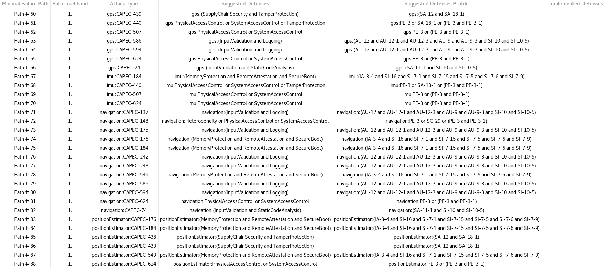

VERDICT Tutorial: Loop Example
==============================

Creating an Architectural Model
-------------------------------

For this example, we will model a simple guidance, navigation and control (GNC)
system. Our GNC uses two subsystems to determine position, a GPS and an IMU.
Both feed their data into a position estimator that supplies a
combined position estimate to a navigation system. The navigation system
takes this position, along with a navigation command and destination position
and informs a controller that issues motor commands. A detailed diagram of the
system architecture is shown below.


For those unfamiliar with AADL, we will highlight some of the basic
ingredients for specifying this system in AADL. We will begin by defining
all of the (sub)-components of the system and their interfaces.
Let's zoom in on the GPS component which receives position data
from two satellites as well as a `constellation` value that identifies the
active satellite. As output, it produces a gps position and a health status.
In this example, we have also added a probe output which allows an analysis
capability to capture component data that isn't otherwise revealed by the
overall GNC system. The complete definition of the GPS component in AADL is below.

```aadl
system GPS
	features
		-- inputs
		constellation: in data port Data_Types::Constellation;
		satellite0_pos: in data port Data_Types::Position.impl;
		satellite1_pos: in data port Data_Types::Position.impl;

		-- outputs
		gps_pos: out data port Data_Types::Position.impl;
		health_status: out data port Base_Types::Boolean;
		probe_constellation: out data port Data_Types::Constellation;

end GPS;
```

We can define the remainder of the component interfaces in a similar way. Below is a
complete AADL definition for the overall GNC system.

```aadl
system GNC
	features
		-- inputs
		constellation: in data port Data_Types::Constellation;
		satellite0_pos: in data port Data_Types::Position.impl;
		satellite1_pos: in data port Data_Types::Position.impl;
		launch_pos: in data port Data_Types::Position.impl;
		navigation_cmd: in data port Base_Types::Boolean;
		navigation_dest_pos: in data port Data_Types::Position.impl;
		fc_actuation_response: in data port Base_Types::Boolean;

		-- outputs
		gps_health_status: out data port Base_Types::Boolean;
		probe_constellation: out data port Data_Types::Constellation;
		imu_health_status: out data port Base_Types::Boolean;
		probe_launch_pos: out data port Data_Types::Position.impl;
		navigation_cur_pos: out data port Data_Types::Position.impl;
		navigation_probe_dest_pos: out data port Data_Types::Position.impl;
		fc_motor_cmd: out data port Base_Types::Boolean;

end GNC;
```

Once we've defined all of the components and their interfaces, we need to define an
implementation model for the GNC system. The implementation will connect the sub-components together
in a way that produces the desired behavior for the overall GNC system. For example, in the
AADL definition below, `gps: system GPS;` defines the GPS system as a sub-component of the
GNC implementation and `i1: port constellation -> gps.constellation;` connects the GNC
`constellation` input to the `constellation` input for the gps sub-component.

```aadl
system implementation GNC.Impl
	subcomponents
		gps: system GPS;
		imu: system IMU;
		positionEstimator: system PositionEstimator;
		navigation: system Navigation;
		fc: system FlightControl;

	connections
		i1: port constellation -> gps.constellation;
		i2: port satellite0_pos -> gps.satellite0_pos;
		i3: port satellite1_pos -> gps.satellite1_pos;
		i4: port launch_pos -> imu.launch_pos;
		i5: port gps.gps_pos -> positionEstimator.gps_pos;
		i6: port gps.health_status -> gps_health_status;
		i7: port gps.probe_constellation -> probe_constellation;
		i8: port imu.imu_pos -> positionEstimator.imu_pos;
		i9: port imu.health_status -> imu_health_status;
		i10: port imu.probe_launch_pos -> probe_launch_pos;

		c1: port positionEstimator.est_pos -> navigation.est_pos;
		c2: port navigation.move -> fc.move;
		c3: port fc.fc_state -> navigation.flight_control_state;
		c24: port navigation.pos_act_out -> positionEstimator.pos_act_in;

		cc1: port navigation.cur_pos -> navigation_cur_pos;
		cc2: port navigation_cmd -> navigation.cmd ;
		cc3: port navigation_dest_pos -> navigation.dest_pos;
		cc4: port navigation.probe_dest_pos -> navigation_probe_dest_pos;
		cc5: port fc.motor_cmd -> fc_motor_cmd;
		cc6: port fc_actuation_response -> fc.actuation_response;

end GNC.Impl;
```

The full AADL model can be found under the `step1-base-model` package.

Analyzing the Architectural Model
---------------------------------

Once we have an architectural model, our next step is to analyze the security of the
design. The first steps towards this is annotating implementations, systems and connections
with their cyber relevant properties and relations. To start with, let's annotate
the GPS system in our GNC implementation. Recall that the GPS sub-component declaration
in the base model was the following `gps: system GPS;`. Our updated declaration that
includes the relevant cyber property annotations is below.

```aadl
gps: system GPS
{
	-- VERDICT Component Properties
	CASE_Consolidated_Properties::canReceiveConfigUpdate => true;
	CASE_Consolidated_Properties::canReceiveSWUpdate => false;
	CASE_Consolidated_Properties::componentType => Hybrid;
	CASE_Consolidated_Properties::insideTrustedBoundary => true;
	CASE_Consolidated_Properties::pedigree => COTS;
	CASE_Consolidated_Properties::hasSensitiveInfo => true;
};
```

The `canReceiveConfigUpdate` and `canReceiveSWUpdate` properties are used
to determine if the system is susceptible to attacks attempting to tamper with the
configuration of a system or attempt to install malicious software updates. The
`componentType` indicates whether the system is susceptible to attacks targeting
software, hardware, humans or a combination thereof. The `insideTrustedBoundary` property
governs if a system will be analyzed as an initial source of an attack and `pedigree`
is used to determine the level of trust in a system. The `hasSensitiveInfo` property is used
to determine if the system should be analyzed for attacks resulting in loss
of confidentiality.

The added annotations are the basic set of mandatory properties that should be
attached to every component in an implementation.
These annotations are required for the the VERDICT toolchain to analyze the
security of the system design.
Later on we will expand this set of annotations with more advanced properties that
include things like cyber defenses.

Next we annotate sub-component connections according to their level of trust. Recall
the definition of the connection `i1: port constellation -> gps.constellation;` that
linked the GNC `constellation` input with the GPS `constellation` input. We can add a
trust annotation to this connection as follows.

```aadl
i1: port constellation -> gps.constellation
{
	CASE_Consolidated_Properties::connectionType => Trusted;
};
```

With all of the components and connections in the system implementation annotated
appropriately, we can add cyber and safety relations to sub-component features.
These annotations will be placed in a VERDICT annex contained in the sub-component
declaration itself. Below is an updated GPS system declaration that includes a
VERDICT annex.

```aadl
system GPS
	features
		-- inputs
		constellation: in data port Data_Types::Constellation;
		satellite0_pos: in data port Data_Types::Position.impl;
		satellite1_pos: in data port Data_Types::Position.impl;

		-- outputs
		gps_pos: out data port Data_Types::Position.impl;
		health_status: out data port Base_Types::Boolean;
		probe_constellation: out data port Data_Types::Constellation;

	annex verdict {**
		CyberRel "gps_out_I" = satellite0_pos:I or satellite1_pos:I => gps_pos:I;
		CyberRel "gps_out_A" = satellite0_pos:A or satellite1_pos:A => gps_pos:A;

		Event {
			id = "loa_event"
			probability = 1.0e-9
			comment = "loss of availability of the GPS"
			description = "LOA"
		}
		Event {
			id = "ued_event"
			probability = 1.0e-8
			comment = "undetected erroneous data of the GPS"
			description = "UED"
		}
		SafetyRel "gps_out_LOA" = happens("loa_event") => gps_pos:A;
		SafetyRel "gps_out_UED" = happens("ued_event") => gps_pos:I;
	**};

end GPS;
```

The cyber relations in the annex describe how the confidentially, integrity and availability of
the inputs affect the confidentiality, integrity and availability of the outputs. For example,
the cyber relation `CyberRel "gps_out_I" = satellite0_pos:I or satellite1_pos:I => gps_pos:I;`
states that the integrity of the `gps_pos` output can be affected by either of the `satellite0_pos`
or `satellite1_pos` inputs. Safety relations can also be defined in VERDICT annexes for
sub-components. The safety relation `SafetyRel "gps_out_LOA" = happens("loa_event") => gps_pos:A;`
states that, when a loss of availability event occurs for the GPS, the availability of the
`gps_pos` output is affected.

With cyber and safety relations added to sub-component types, the final ingredient we need prior to
conducting a cyber architectural analysis is to add cyber and mission requirements to the top-level GNC
system implementation. These requirements will be added to a VERDICT annex in the GNC system
type declaration. Example cyber and mission requirements for the GNC are below.

```aadl
annex verdict{**
	CyberReq {
		id = "CyberReq01"
		description = "No loss of integrity for the motor command."
		condition = fc_motor_cmd:I
		severity = Hazardous
	};
	MissionReq {
	    	id ="MReq01"
	    	description = "Combined cyber requirements."
	    	reqs = "CyberReq01"
    	};
**};

```

We are now ready to run an architectural analysis. This can be done in OSATE
by selecting:

`Verdict -> Run Model Based Architecture Analysis (MBAA)`

Each cyber requirement defined in the model will be analyzed and VERDICT
will display the results in a dialog like the one below.


As indicated in the result dialog, the cyber requirement `CyberReq01` doesn't hold.
To understand why, right click on a failing cyber requirement and select `view failure paths`.
This will generate a list of cyber attacks that violate the given requirement.



Each failure path describes an attack scenario along with a suggested set of defenses.
Let's examine paths 85 and 86 in our example. CAPEC-438 indicates that the position estimator
component is vulnerable to modification during manufacture and CAPEC-439 indicates that
it is vulnerable to manipulation during distribution. In the next section, we will show
how VERDICT can be used to derive cyber requirements that guard against these attacks.

The full AADL model with VERDICT property annotations (before any cyber defenses have been applied)
can be found under the `step2-verdict-annotations` package.

Generating Architectural Security Requirements
----------------------------------------------

Using the attack paths uncovered by the MBAA tool, our next objective is to derive a set of
cyber requirements that mitigate these attacks. Let's start by reviewing the defenses
suggested in the MBAA result. For the CAPEC-438 and CAPEC-439 attacks, MBAA recommends
reducing these threats through supply chain security and tamper protection.
Let's add these defenses (cyber requirements) to our architectural model.
To do so, add the following properties to the PositionEstimator component in the GNC implementation.

```text
-- VERDICT Cyber Defense and DAL Mitigations
CASE_Consolidated_Properties::tamperProtection => 7;
CASE_Consolidated_Properties::supplyChainSecurity => 7;
```

Each property is assigned a number between 0 and 9 that indicates the
level of rigor used when applying the defenses. A higher number means a lower probability of
attack. If we re-run MBAA with these defenses added as properties, we get the following result.


The probability of attack for the CAPEC-438 and CAPEC-439 vulnerabilities goes from `1` to `1e-07`.
Also notice that the `Implemented Defenses` column has been updated to include the properties we added.
We can repeat this process of examining other attack paths and applying system defenses until the
desired level of security is achieved. On our simple system this would require going though 88 attack
paths. Fortunately, a streamlined method of deriving requirements is avaliable through the MBAS tool.
MBAS will synthesize required cyber defenses according to a cost model. If no model is supplied, MBAS will
include all cyber defenses needed to mitigate the attacks uncovered during
the architecture analysis (with default costs).
We can run MBAS by selecting `Verdict -> Run Model Based Architecture Synthesis (MBAS)` in OSATE. The
MBAS result for our example is shown below.


The synthesis results include a list of recommended cyber defenses with an associated cost. All of
the defenses can be applied to the project by clicking the `Apply Changes to Project` button.
In some scenarios, it might be impractical or too expensive to require *all* cyber defenses for
a given system. In these cases, the goal is to optimize for the highest level of while remaining at
or under a given resource cost. MBAS aids this kind of reasoning by providing configurable cost models.
Cost models can be configured via VERDICT interface embedded into OSATE or manually via a `costModel.xml`
such as the one below.

```xml
<cost-model>
<cost component="GNC.Impl:::positionEstimator" dal="7" defense="tamperProtection">4.0</cost>
</cost-model>
```

This assigns a cost of `4` for applying the cyber defense `tamperProtection` at level `7` to the
`positionEstimator` component.

The full AADL model with VERDICT property annotations including all cyber defenses synthesized by MBAS
can be found under the `step3-post-mbas` package.

Describing Behavioral Properties
--------------------------------

So far in our modeling we have outlined what components exist, what interfaces the components have and how they
are connected together. What we haven't described is what the components are actually intended to do.
In AADL, such behaviors are most naturally described through AGREE contracts.
These contracts describe system behavior through assigning guarantees to the
output of a component given some assumptions about its input. Let's look at an example.

```aadl
system GPS
	features
		-- inputs
		constellation: in data port Data_Types::Constellation;
		satellite0_pos: in data port Data_Types::Position.impl;
		satellite1_pos: in data port Data_Types::Position.impl;

		-- outputs
		gps_pos: out data port Data_Types::Position.impl;
		health_status: out data port Base_Types::Boolean;
		probe_constellation: out data port Data_Types::Constellation;

	annex agree {**
		-- variables
		eq satellite0_selected: bool =
            (constellation = enum(Data_Types::Constellation, Satellite0));
		eq selected_satellite_pos: Data_Types::Position.impl =
			if satellite0_selected then satellite0_pos else satellite1_pos;

	 	-- high-level specification
	 	guarantee "Output: gps_pos": Agree_Nodes::close_locations(gps_pos,
                                                                  selected_satellite_pos);

	 	-- probe outputs
	 	guarantee "Output: probe_constellation": probe_constellation = constellation;
	**};
end GPS;
```

Here we have added an AGREE annex to our GPS component. The lines beginning with the `eq` create variables
to be used in behavioral contracts. In particular, `satellite0_selected` is of type `bool` and is true exactly
when the `constellation` input value is set to `Satellite0`. Similarly the `selected_satellite_pos` variable
holds the position value `satellite0_pos` when `satellite0_selected` is `true` and otherwise it holds `satellite1_pos`.
Behavioral contracts are created through the `guarantee` keyword. The first contract, called "Output: gps_pos",
states that the `gps_pos` should be close to (the same as) the value of the `selected_satellite_pos`
variable we just defined. The second states that the value of the `probe_constellation` output matches
the value of the `constellation` input.

What properties might we want to describe about the overall GNC system? Recall that the GNC accepts a
`navigation_dest_pos` as input and produces, among other things, a `fc_motor_cmd` and a
`navigation_cur_pos` as output. The `navigation_cur_pos` is calculated from the `positionEstimator`
that relies on the `GPS` and `IMU` components. One natural property we can describe about the system
is that no motor command should be issued if the destination position is close enough to the
current position. This requirement can be captured in AGREE as follows.

```aadl
annex agree{**
	guarantee "Property P1: No motor command if we are at the destination":
		Agree_Nodes::close_locations(navigation_dest_pos, navigation_cur_pos)
            => not fc_motor_cmd;
**};
```

For this property to hold over the implementation, there are several additional agree contracts we must
add to the sub-components. In particular, the `FlightControl` should only issue a motor command if it
receives a move command from the navigation component. In turn, the `Navigation` component should not
issue a move command if its current and destination positions match. Further, the current position output by
the `Navigation` component should match the estimated position received from the `PositionEstimator`. Once all
of these additional contracts are added to our model, we can verify property P1 holds for
the GNC implementation using VERDICT. To do so, navigate to `Verdict -> CRV settings` in OSATE and
deselect all of the threat models. Next, navigate to `Verdict -> Run Cyber Resilience Verifier (CRV)`.
If all of the contracts are setup correctly, this should produce a result similar to the following.


For a more complete tutorial on AGREE, see
[this tutorial](https://github.com/ge-high-assurance/VERDICT/wiki/Appendix-A--AADL-Modeling-Tutorial).

The full AADL model with AGREE property annotations
can be found under the `step4-agree` package.

Analyzing Behavioral Properties with an Attacker
------------------------------------------------

In the last step, we used VERDICT to verify a behavioral property of our system in a adversary free
environment. In this section we will use VERDICT to analyze these properties in view of an attacker
that reasons over different threat models. To run the analysis, navigate to `Verdict -> CRV settings`
in OSATE and select all of the threat models. Then select `Verdict -> Run Cyber Resilience Verifier (CRV)`
as before.


CRV uncovers three attacks types (network injection, insider threat, logic bomb) that would enable an
attacker to violate Property P1 from the previous section. To understand why these attacks are
possible, recall that a move command is issued by the `Navigation` component if the current and destination
positions match. The calculation of these positions involves the flow of data between many sub-components
such as the `PositionEstimator` or `GPS` components. If data from these components is corrupted
at any point in the chain, an attacker can mislead the `Navigation` component into believing the
current and destination positions differ, even though they may not. This can result in improper move
commands being issued. To defend against this attack, we'll need to make sure the necessary communication
links between sub-components are trusted. CRV can aid in identifying these links through the
`critical links` section in its output. It's also possible to right click on the violated property and
select "View counter-example" to exame concretely how values are manipulated during a concrete attack
trace. Once we've identified the critical links, the appropriate cyber requirements can be added to ensure
they are trusted. For example, the following property will require system implementations to
design the connection that transmits the move command between the `Navigation` and `FlightControl` components
to be resilient against network injection.

```aadl
c2: port navigation.move -> fc.move
{
	CASE_Consolidated_Properties::connectionType => Trusted;
};
 ```

By incrementally adding trust requirements to the connections in our model, we can defend against
the attack types uncovered by CRV. It’s important to point out that achieving “complete”
protection against the attacks identified by MBAS and CRV may not always be practical.
Security professionals need to weigh the cost of cyber requirements with
resource limits, the functional requirements of the system and the consequences of failure.
Often times this results in a risk assessment wherein only cyber requirements that defend
against threats of a given type or impact level are included.

The full AADL model including the complete set of cyber requirements derived from
MBAS and CRV can be found under the `step5-post-crv` package.
