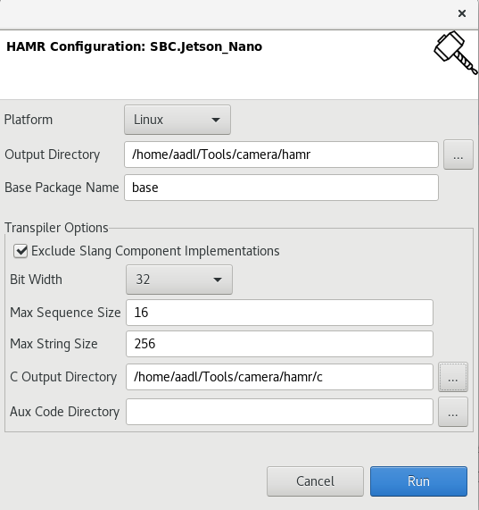
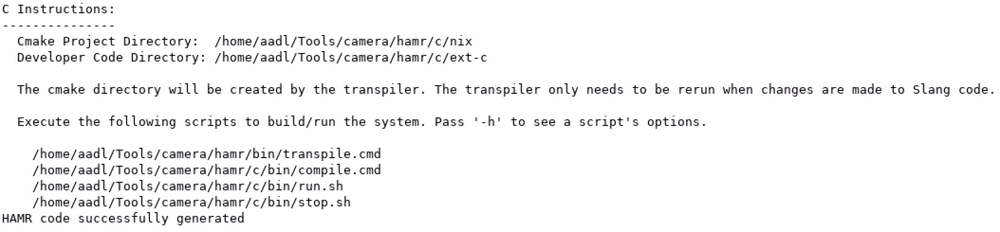

HAMR Tutorial
=============

HAMR is a code generation tool that translates AADL models into C code. To program a system in HAMR,
one starts by defining a component-based architecture in AADL. Using HAMR, this architecture is then
used to generate a runtime environment and interfacing infrastructure for a component oriented system.
The runtime environment implements the scheduling and threading model from the AADL semantics, providing
the backbone for inter-component communication. The HAMR code generator also produces APIs and skeleton
code for integrating components into the runtime environment. This allows developers to focus on the component
application logic, which is the only piece of the system developed by hand. HAMR supports a variety of
languages for developing the component logic.

Let's see HAMR in action. For this tutorial, we are going to apply HAMR to the camera model.

AADL Model Requirements
-----------------------

Before we run HAMR, we need to make sure our AADL model is suitable for code generation. The first
thing we'll want to inspect is the types of the components in our model. HAMR generates code that allows
components of `Thread` type to communicate. If an AADL model doesn't contain threads, running HAMR
isn't going to produce a result.

### Annotating Systems

Once we have an AADL model that includes threads, we'll need to extend the model with HAMR-specific annotations.
The first set of annotations will be added to the system implementation. These annotations are high-level directives
that govern the behavior of the code generator across the entire system. To illustrate the annotations, we will use the
Jetson_Nano system from the camera model, as shown below.

```aadl
system implementation SBC.Jetson_Nano
	subcomponents
		arm64: processor;
		gpu: processor;
		sw: process SW.Impl;
	connections
		c1: port csi -> sw.csi;
		c2: port sw.spi -> spi;
		c3: port eth -> sw.eth;
	properties
		Actual_Processor_Binding => (reference (arm64)) applies to SW;
		HAMR::Platform => (linux);
		HAMR::Bit_Codec_Raw_Connections => true;
end SBC.Jetson_Nano;
```

The first HAMR-specific annotation on the system is the `HAMR::Platform` property. This property describes
the set of platforms that can be targeted for code generation. Available platforms include  `JVM`, `linux`, `macOS`,
`cygwin` and `sel4`. The second HAMR-specific annotation is the `HAMR::Bit_Codec_Raw_Connections`  property.
This property specifies whether or not the wire protocol should be used for connections between threads.
If enabled, only raw byte arrays can be passed between components. This means that all of the AADL data types
communicated between threads must specify a maximum number of bits (or bytes) required to hold a value of that type.

### Annotating Threads

The software component of our Jetson Nano system is a process that contains 4 threads; a clock,
a recognition algorithm, an alert system and a tracking algorithm. Let's zoom in on the thread
implementation for the tracking algorithm.

```aadl
thread implementation Track.Impl
	properties
		Dispatch_Protocol => Periodic;
		Period => 500ms;
		Compute_Execution_Time => 10ms .. 50ms;
		Stack_size => 1048576 Bytes;
end Track.Impl;
```

HAMR relies on properties in the thread implementation to dictate the runtime environment it
builds.  In particular, the `Dispatch_Protocol` property describes the dispatch protocol
for thread outputs. The supported protocols are below.

- Periodic: periodic dispatch of threads with deadlines
- Sporadic: event-triggered dispatching of threads with soft deadlines
- Aperiodic: event-triggered dispatch of threads with hard deadlines.
- Timed: threads are dispatched after a given time unless they are dispatched by arrival of an event or event data.
- Hybrid: threads are dispatched by both an event or event data arrival and periodically
- Background: threads are dispatched once and execute until completion

When the dispatch protocol is `Periodic`, `Timed` or `Hybrid`, the `Period` property must also be specified.
In our example above, we have chosen a `Periodic` dispatch protocol with a `Period` of 500 milliseconds.

In addition to the properties above, HAMR also requires that threads define the concrete data types they communicate over.
In AADL, it's perfectly legal to define features for threads that don't include data
types. For example, the following thread definition is valid.

```aadl
thread Track
	features
		bounds_boxes: in data port;
		pan: out data port;
		tilt: out data port;
		zoom: out data port;
end Track;
```

However, HAMR requires that each feature in a thread is annotated with a data type. Adding these types
to our camera model results in the following thread definition. We'll take a closer look at the data
type specifics in the next section.

```aadl
thread Track
	features
		bounds_boxes: in data port Data_Types::Bound_Boxes.Impl;
		pan: out data port Data_Types::Serial_Bus_Packet.Impl;
		tilt: out data port Data_Types::Serial_Bus_Packet.Impl;
		zoom: out data port Data_Types::Serial_Bus_Packet.Impl;
end Track;
```

### Annotating Data

The final group of AADL annotations we provide allow HAMR to assign a concrete size to the data types the threads in the
model communicate over. Let's take the `Bound_Boxes` data type used by the `Track` thread as input.

```aadl
data Bound_Boxes
end Bound_Boxes;

data implementation Bound_Boxes.Impl
	properties
		HAMR::Bit_Codec_Max_Size => 16 Bytes;
end Bound_Boxes.Impl;
```

Notice that we have assigned the `HAMR::Bit_Codec_Max_Size` property to the implementation.
This tells HAMR the maximum number of bits (or bytes) required to hold a value of that type.

Running HAMR
------------

Once we have properly extended our AADL model to support HAMR, we can use it generate code. To do so,
select a system implementation and then click the HAMR icon is OSATE. This will bring up the HAMR configuration dialog.



Modify your configuration to match the one above.
The first option allows us to specify the target runtime platform. In our case, we'll choose `Linux`.
Next, run `mkdir -p ~/Tools/hamr/c` and fill in the `Output Directory` and `C Output Directory` fields.
The other important piece of the configuration is the `Exclude Slang Component Implementations`
option. When this is selected, components will be manually implemented in C, as opposed to being
auto-generated in Slang. After all of the configuration options are set, select `Run`.
When HAMR completes successfully, the final portion of the
output provides instructions for compiling and running the generated code.



Let's go ahead and compile and run our components. To compile, run the following commands.

```shell
/home/aadl/Tools/camera/hamr/bin/transpile.cmd
cd /home/aadl/Tools/camera/hamr/c/bin
./compile.cmd
```

Before we run the generated code, edit `run.sh` to replace `x-terminal-emulator`
with `gnome-terminal`. The script below script should make the edits
automatically:

```shell
sed -i 's/x-terminal-emulator -T \([^ ]\+\) -e \
    sh -i -c/gnome-terminal -t \1 -- sh -i -c/' run.sh
```

Now invoke the run script via `./run.sh`. A new terminal window should open and
indicate that each component and port is being initialized. In our case, this
initializes four components:

```
Using the round robin order provided in architecture/base/Schedulers.scala. Edit method 
  base_ScheduleProviderI_getRoundRobinOrder located in round_robin.c
to supply your own
Art: Registered component: Tracking_Camera_Impl_Instance_jetson_sw_clock (periodic: 500)
Art: - Registered port: Tracking_Camera_Impl_Instance_jetson_sw_clock_ntp (data in)
Art: - Registered port: Tracking_Camera_Impl_Instance_jetson_sw_clock_time (data out)
Art: Registered component: Tracking_Camera_Impl_Instance_jetson_sw_recog (periodic: 500)
Art: - Registered port: Tracking_Camera_Impl_Instance_jetson_sw_recog_video (data in)
Art: - Registered port: Tracking_Camera_Impl_Instance_jetson_sw_recog_bounds_boxes (data out)
Art: - Registered port: Tracking_Camera_Impl_Instance_jetson_sw_recog_image_tags (data out)
Art: Registered component: Tracking_Camera_Impl_Instance_jetson_sw_alert (periodic: 500)
Art: - Registered port: Tracking_Camera_Impl_Instance_jetson_sw_alert_image (data in)
Art: - Registered port: Tracking_Camera_Impl_Instance_jetson_sw_alert_image_tags (data in)
Art: - Registered port: Tracking_Camera_Impl_Instance_jetson_sw_alert_time (data in)
Art: - Registered port: Tracking_Camera_Impl_Instance_jetson_sw_alert_report (data out)
Art: Registered component: Tracking_Camera_Impl_Instance_jetson_sw_track (periodic: 500)
Art: - Registered port: Tracking_Camera_Impl_Instance_jetson_sw_track_bounds_boxes (data in)
Art: - Registered port: Tracking_Camera_Impl_Instance_jetson_sw_track_pan (data out)
Art: - Registered port: Tracking_Camera_Impl_Instance_jetson_sw_track_tilt (data out)
Art: - Registered port: Tracking_Camera_Impl_Instance_jetson_sw_track_zoom (data out)
Art: Connected ports: Tracking_Camera_Impl_Instance_jetson_sw_clock_time -> Tracking_Camera_Impl_Instance_jetson_sw_alert_time
Art: Connected ports: Tracking_Camera_Impl_Instance_jetson_sw_recog_bounds_boxes -> Tracking_Camera_Impl_Instance_jetson_sw_track_bounds_boxes
Art: Connected ports: Tracking_Camera_Impl_Instance_jetson_sw_recog_image_tags -> Tracking_Camera_Impl_Instance_jetson_sw_alert_image_tags
```

Next, the components and interfaces are initialized:

```
Tracking_Camera_Impl_Instance_jetson_sw_clock: base_SBC_Clock_Impl_jetson_sw_clock_initialise_ called
Tracking_Camera_Impl_Instance_jetson_sw_clock: Initialized bridge: Tracking_Camera_Impl_Instance_jetson_sw_clock
Tracking_Camera_Impl_Instance_jetson_sw_recog: base_SBC_Recog_Impl_jetson_sw_recog_initialise_ called
Tracking_Camera_Impl_Instance_jetson_sw_recog: Initialized bridge: Tracking_Camera_Impl_Instance_jetson_sw_recog
Tracking_Camera_Impl_Instance_jetson_sw_alert: base_SBC_Alert_Impl_jetson_sw_alert_initialise_ called
Tracking_Camera_Impl_Instance_jetson_sw_alert: Initialized bridge: Tracking_Camera_Impl_Instance_jetson_sw_alert
Tracking_Camera_Impl_Instance_jetson_sw_track: base_SBC_Track_Impl_jetson_sw_track_initialise_ called
Tracking_Camera_Impl_Instance_jetson_sw_track: Initialized bridge: Tracking_Camera_Impl_Instance_jetson_sw_track
```

Finally should see the components taking turns logging data being received from other
components. As mentioned in the message above, a round-robin scheduler is used by
default, although this is configurable:

```
Tracking_Camera_Impl_Instance_jetson_sw_alert: Received data on data port image_tags: 
[ FF FF FF FF ]
Tracking_Camera_Impl_Instance_jetson_sw_alert: Received data on data port time: 
[ FF FF FF FF ]
Tracking_Camera_Impl_Instance_jetson_sw_track: Received data on data port bounds_boxes: 
[ FF FF FF FF FF FF FF FF FF FF FF FF FF FF FF FF ]
Tracking_Camera_Impl_Instance_jetson_sw_alert: Received data on data port image_tags: 
[ FF FF FF FF ]
```

The data being sent and received is sample data that was included in the component skeletons generated by HAMR.
We will talk more about this in a minute. To stop the simulation, run `./stop.sh`.

A Closer Look at the Generated Code
-----------------------------------

Let's take a closer look at the generated code for the tracking thread we modeled earlier.
Below is the header file for the tracking thread API calls.

```c
#ifndef TRACK_IMPL_SW_TRACK_API_H
#define TRACK_IMPL_SW_TRACK_API_H

#include <all.h>

// This file was auto-generated.  Do not edit

bool api_get_bounds_boxes__base_SBC_Track_Impl_sw_track(
  STACK_FRAME
  size_t *numBits,
  uint8_t *byteArray);

void api_put_pan__base_SBC_Track_Impl_sw_track(
  STACK_FRAME
  size_t numBits,
  uint8_t *byteArray);

void api_put_tilt__base_SBC_Track_Impl_sw_track(
  STACK_FRAME
  size_t numBits,
  uint8_t *byteArray);

void api_put_zoom__base_SBC_Track_Impl_sw_track(
  STACK_FRAME
  size_t numBits,
  uint8_t *byteArray);

void api_logInfo__base_SBC_Track_Impl_sw_track(
  STACK_FRAME
  String str);

void api_logDebug__base_SBC_Track_Impl_sw_track(
  STACK_FRAME
  String str);

void api_logError__base_SBC_Track_Impl_sw_track(
  STACK_FRAME
  String str);

#endif
```

Recall that the tracking thread receives a bounds box data type as input and outputs pan, tilt and zoom values.
The function generated for receiving the bounds box input is
```c
api_get_bounds_boxes__base_SBC_Track_Impl_sw_track
```
Likewise, there are 3 `put` functions, including
```c
api_put_pan__base_SBC_Track_Impl_sw_track
```
for sending the pan, tilt and zoom values to other threads. Finally, there are
API calls for logging info, debug and error messages.  This API can be used to
create components, where each component is required implement 3 functions:
`initialise`, `finalise` and a `triggered` function whose exact type depends on
the chosen dispatch protocol.  By default, HAMR will generate skeleton code for
components with examples for how to invoke the API.  Below is the example
`initialise` function generated by HAMR for the tracking thread component.

```c
Unit base_SBC_Track_Impl_sw_track_initialise_(STACK_FRAME_ONLY) {
  DeclNewStackFrame(caller, "Track_Impl_sw_track.c", "",
                            "base_SBC_Track_Impl_sw_track_initialise_", 0);

  // examples of api setter and logging usage

  uint8_t t0[numBytes_base_Data_Types_Serial_Bus_Packet_Impl];
  byte_array_default(SF t0, numBits_base_Data_Types_Serial_Bus_Packet_Impl,
                            numBytes_base_Data_Types_Serial_Bus_Packet_Impl);
  api_put_pan__base_SBC_Track_Impl_sw_track(SF
    numBits_base_Data_Types_Serial_Bus_Packet_Impl, t0);

  uint8_t t1[numBytes_base_Data_Types_Serial_Bus_Packet_Impl];
  byte_array_default(SF t1, numBits_base_Data_Types_Serial_Bus_Packet_Impl,
                            numBytes_base_Data_Types_Serial_Bus_Packet_Impl);
  api_put_tilt__base_SBC_Track_Impl_sw_track(SF
    numBits_base_Data_Types_Serial_Bus_Packet_Impl, t1);

  uint8_t t2[numBytes_base_Data_Types_Serial_Bus_Packet_Impl];
  byte_array_default(SF t2, numBits_base_Data_Types_Serial_Bus_Packet_Impl,
                            numBytes_base_Data_Types_Serial_Bus_Packet_Impl);
  api_put_zoom__base_SBC_Track_Impl_sw_track(SF
    numBits_base_Data_Types_Serial_Bus_Packet_Impl, t2);

  api_logInfo__base_SBC_Track_Impl_sw_track(SF string("Example logInfo"));

  api_logDebug__base_SBC_Track_Impl_sw_track(SF string("Example logDebug"));

  api_logError__base_SBC_Track_Impl_sw_track(SF string("Example logError"));
}
```

The `initialise` and `finalize` functions are called on component start-up and shut-down, respectively.
Notice that the `initialise` function contains example code sending pan, tilt and zoom values
in addition to code for creating log messages of various types. These examples values are what we observed
when we ran the system in the previous section. The other interesting function a component must implement
is a "triggered" function. Because we chose periodic dispatch when we defined the tracking thread in AADL,
the implementation includes a `timeTriggered` function.

```c
Unit base_SBC_Track_Impl_sw_track_timeTriggered_(STACK_FRAME_ONLY) {
  DeclNewStackFrame(caller, "Track_Impl_sw_track.c", "",
                            "base_SBC_Track_Impl_sw_track_timeTriggered_", 0);

  // examples of api getter usage

  uint8_t t0[numBytes_base_Data_Types_Bound_Boxes_Impl];
  size_t t0_numBits;
  if(api_get_bounds_boxes__base_SBC_Track_Impl_sw_track(SF &t0_numBits, t0)) {
    // sanity check
    sfAssert(SF (Z) t0_numBits == numBits_base_Data_Types_Bound_Boxes_Impl,
        "numBits received does not match expected");

    DeclNewString(bounds_boxes_str);
    String__append(SF (String) &bounds_boxes_str, string("Received on bounds_boxes: "));
    byte_array_string(SF (String) &bounds_boxes_str,
                      t0, numBytes_base_Data_Types_Bound_Boxes_Impl);
    api_logInfo__base_SBC_Track_Impl_sw_track(SF (String) &bounds_boxes_str);
  }
}
```

The `timeTriggered` function is invoked when the thread is dispatched. It only defines incoming event data ports.
Per the AADL semantics, ports are frozen during dispatch to ensure arrival of new data doesn't impact computation.

All of the code populated in the `initialise`, `finalize` and `timeTriggered` functions is example
code. The contents of those functions can be edited to include the desired implemation logic.

When to use HAMR
----------------

HAMR is a great choice when building new systems from scratch. One can get an entire stack up and running using
very little user-written code. Further, when systems are developed and maintained in HAMR, the workflow for keeping
models and implementation code in sync is clean. As a result, all of the analysis and assurances conducted over the
model have a direct impact on the actual system. We should note that, when we say HAMR works well for fresh
system development, we really mean a fresh runtime system. HAMR can quite seamlessly integrate legacy
components by wrapping them inside of the component APIs.

There are many scenarios where the runtime environment provided by HAMR is not suitable for deployment in a particular
context. This could be a result of legacy requirements or safety constraints. It is often the case that there
is inherently less trust in machine generated code than code written by a human. Even in these cases,
HAMR can still be a valuable tool for rapid prototyping, evaluation of new architectural designs
and validation of component interoperation.
