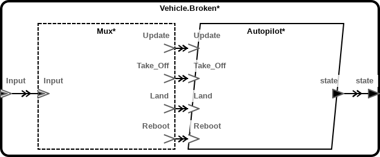
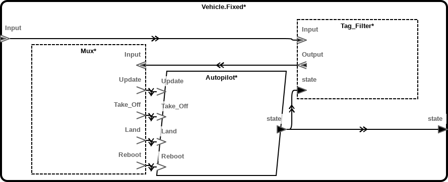

So You Want To Model A Stateful Protocol
========================================

Goal
----

Model a stateful system with safety properties that require certain state
transitions never occur. State transitions are governed by the previous state
of the system and the protocol messages received. Use model checking to ensure
that no sequence of protocol messages will cause the undesired transitions, or
find a sequence of transitions that trigger them.

The System to be Modeled
------------------------

The system we will model is a simplified UAV whose states are `BOOTING`,
`STANDBY`, `FLYING`, and `UPDATING`. The UAV starts in the `BOOTING` state.
When the UAV is `FLYING` or in `STANDBY`, it can accept commands in the format
given below.  When the UAV is `BOOTING`, it does not accept commands, but
automatically transitions to `STANDBY` mode. Similarly, when the UAV is
`UPDATING`, representing that it is undergoing a firmware update, it does not
accept commands, but automatically reboots (transitions to `BOOTING`) when the
update is complete.

The UAV accepts the commands `TAKE_OFF`, `LAND`, `REBOOT`, and `UPDATE`. The
update command is accompanied by firmware data, preceeded by a 14-bit length
field. The message format is as follows:

```text
 0 1 2 3 4 5 6 7 8 9 a b c d e f ...
+---+---------------------------+---
|   |                           |
+---+---------------------------+---
  ^   ^                           ^
  |   |                           |
  |   |         Firmware data ----+
  |   +---- Firmware data length
  +---- Message type
```

When a `TAKE_OFF` messages is received, the system transitions into (or
remains in) the `FLYING` state, and when a `LAND` message is received, the
system transitions into (or remains in) the `STANDBY` state. `REBOOT` messages
are ignored when the UAV is `FLYING`, in order to prevent the vehicle from
rebooting in the air and (literally) crashing.

In a higher-fidelity model, of course, these transitions would not be
immediate, with at least a (probably lengthy) `LANDING` state to model the
mode in which the UAV is preparing to land. Similarly, a higher-fidelity model
would probably have many more states and message types. The ones described
here suffice for this example, though.

A mock-up of this system is represented in `autopilot.c`. The controller in
`controller.c` simply sends random messages at irregular intervals. The
autopilot enacts the state machine described above and prints out the current
state at each step. Executing `make run` will run the two together.

Safety Properties
-----------------

In this example, we are interested in a simple safety property: We want to
ensure that the UAV cannot reboot while it is flying. As mentioned above, the
state machine implemented in `autopilot.c` prevents direct transitions from
`FLYING` to `BOOTING`. Unfortunately, this transition alone does not capture
event we wish to prevent, since other states (besides `STANDBY`) might occur
between `FLYING` and `BOOTING` and still result in an undesirable state. In
particular, the sequence `FLYING -> UPDATING -> BOOTING` is also undesirable.

One way to sum up the property we're interested in is that, when we enter the
state `BOOTING`, the UAV should not be "airborne", defined as having entered
the state `FLYING` since the last time it was on `STANDBY`. In AGREE,
airborne can be defined as follows:

```aadl
fun is_airborne(st : int) : bool =
    AGREE_PLTL::Since(not (st = STANDBY), st = FLYING);
```

The above can be read as "the state has not been STANDBY since it was last
FLYING". So the safety property we want for the `Vehicle` system can be
defined as follows:

```aadl
guarantee "Vehicle does not reboot while flying" :
    state = BOOTING => not is_airborne(state);
```

Running AGREE by using `Verify All Layers` on `Vehicle.Broken` in
`vehicle.aadl` should produce a sequence of messages that causes the UAV to
reboot while airborne by sending an update message while the vehicle is
`FLYING`.

```text
Variables for Autopilot
--------------------------------------------------------------------------
Variable Name                   0        1        2        3        4
--------------------------------------------------------------------------
{Autopilot..ASSUME.HIST}        true     true     true     true     true
{Autopilot.Land._EVENT_}        false    false    false    false    false
{Autopilot.Reboot._EVENT_}      false    false    false    false    false
{Autopilot.Take_Off._EVENT_}    false    true     false    false    false
{Autopilot.Update._EVENT_}      false    false    true     false    true
{Autopilot.state}               0        1        2        3        0

```

Reading the above, we see that the problematic message sequence is a
`TAKE_OFF`, followed by an `UPDATE`. The state transition sequence is `BOOTING
-> STANDBY -> FLYING -> UPDATING -> BOOTING`.

The Model
---------



The main component of this model is the `Autopilot` process. It has in ports
for each message type and a metavariable called `state` that we will use to
track the vehicle's state information for verification. Importantly, it also
contains the logic for transitioning from one state to the next.

```aadl
process Autopilot
features
    Take_Off : in event port;
    Land     : in event port;
    Reboot   : in event port;
    Update   : in event port;

    state : out data port Base_Types::Natural;
annex agree {**
    assume "Input messages mutually exclusive" :
        mutex4(event(Take_Off), event(Land), event(Reboot), event(Update));
    guarantee "State transitions" : state = (BOOTING ->
        -- If in BOOTING or UPDATING mode, ignore commands and transition
        -- to next state.
        if pre(state) = BOOTING
            then STANDBY
        else if pre(state) = UPDATING
            then BOOTING

        -- Otherwise accept commands and change state. The order doesn't
        -- matter, since inputs are mutually exclusive.
        else if pre(event(Land))
            then STANDBY
        else if pre(event(Take_Off))
            then FLYING
        else if pre(event(Update))
            then UPDATING

        -- Guard against accepting reboot command when airbourne.
        else if pre(state) <> FLYING and pre(event(Reboot))
            then BOOTING

        -- Retain state otherwise.
        else
            pre(state)
    );
**};
end Autopilot;
```

The state transition logic corresponds to the logic in `autopilot.c` in a
straightforward way, but it could also be the result of experimentally
analyzing the system's behavior, e.g., by sending messages and determining the
system's response. It also matches the state transition logic described above.

We describe the messages the UAV can receive in `protocol.aadl`. The message
format is expressed in `Message.I`, and the translation from this format to
AADL's semantic representation is expressed using the abstract `Mux`
component, which does nothing but take messages in and delegate them to the
correct AADL port. We specify the logic of this translation in AGREE:

```aadl
abstract Mux
features
    Input : in event data port Message.I;

    Take_Off : out event port;
    Land     : out event port;
    Reboot   : out event port;
    Update   : out event port;
annex agree {**
    guarantee "Input tag is valid" : tag_is_valid;
    guarantee "Output matches input if present" :
        output_matches_input_if_present;

    property output_matches_input_if_present =
        output_event => event(Input) and
            (event(Take_Off) => is_take_off) and
            (event(Land)     => is_land) and
            (event(Reboot)   => is_reboot) and
            (event(Update)   => is_update);

    property output_event =
        event(Take_Off) or
        event(Land) or
        event(Reboot) or
        event(Update);

    property tag_is_valid =
        is_take_off or is_land or is_reboot or is_update;

    property is_take_off = Input.Tag = TAKE_OFF;
    property is_land     = Input.Tag = LAND;
    property is_reboot   = Input.Tag = REBOOT;
    property is_update   = Input.Tag = UPDATE;
**};
end Mux;
```

Intuitively, all the above says is that an input message event generates an
output event of the type corresponding to its tag. It additionally guarantees
that the input tag is one of `TAKE_OFF`, `LAND`, `REBOOT`, or `UPDATE`. This
is true because the input is two bits long, so those four values comprise all
possible assignments. This guarantee is necessary because the current version
of agree approximates all integers with unbounded integral values.

Finally, the root system is given in `vehicle.aadl`, which contains an input
for protocol messages and a state metavariable. This is where we state our
main security property. The base implementation (`Vehicle.Broken`) contains
only the `Autopilot` process and the `Mux`.

```aadl
system Vehicle
features
    Input : in event data port Protocol::Message.I;

    state : out data port Base_Types::Natural;
annex agree {**
    guarantee "Vehicle does not reboot while flying" :
        is_booting => is_grounded(state);

    eq is_booting  : bool = state = Autopilot::BOOTING;
    eq is_standby  : bool = state = Autopilot::STANDBY;
    eq is_flying   : bool = state = Autopilot::FLYING;
    eq is_updating : bool = state = Autopilot::UPDATING;
**};
end Vehicle;
```

Fixing the Bug
--------------

Running `Verify All Layers` should yield a sequence of messages that causes
the vehicle to reboot while flying. The problem is that `UPDATE` messages are
allowed while the vehicle is flying, and the `UPDATING` state transitions to
`BOOTING` after one time step.

One solution would be to add a component that tracks the vehicle's state and
filters out `UPDATE` messages when the vehicle is airborne. This is the
solution implemented in `Vehicle.Fixed`.



Describing this filter element in AADL is straightforward. We place it before
the protocol Mux, and it does nothing more than pass messages along if they
satisfy the required condition.

```aadl
abstract Tag_Filter
features
    Input  : in  event data port Protocol::Message.I;
    Output : out event data port Protocol::Message.I;

    state : in data port Base_Types::Natural;
annex agree {**
    guarantee "Output is filtered input" :
        if filter_input_tag
            then event(Output) and Output = Input
            else not event(Output);

    eq filter_input_tag : bool =
        is_airborne(state) => Input.Tag != Protocol::UPDATE;
**};
end Tag_Filter;
```

One subtle aspect of this particular filter is that it must keep track of
whether the vehicle is flying. It could do this by observing message tags and
internally mirroring the state transitions that occur in the autopilot
process. In this case, however, we assume that the filter can keep track of
the autopilot's state directly, perhaps by monitoring its output to the
vehicle's actuators.
