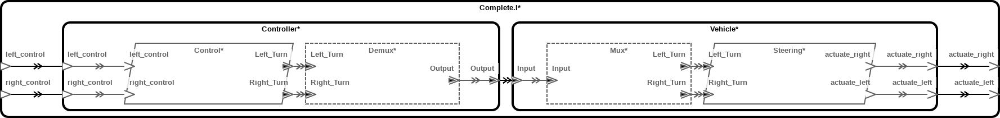
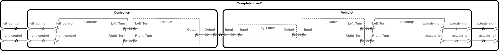

Tagged-messages, or "So You Want to Parse Wire Protocols"
===============

Goal
----

To model a system with components that communicate using a specific
message format that relies on a tag to distinguish between message types. We
start by modeling the behavior of such a system based on source code, and show
how model checking can be used to find common errors in these behavior models.
Finally, we fix the error we find and show how to validate that the behavior
model now conforms to the requirements.

A Wire Protocol
---------------

This example models a simple fragment of a vehicle control protocol. The
controller component sends 16-bit steering messages to the vehicle component
with the following format:

```text
 0 1 2 3 4 5 6 7 8 9 A B C D E F
+-+-----------------------------+
| |                             |
+-+-----------------------------+
 ^      ^
 |      |
 |      +--- 15-bit turn angle
 +--- 1-bit message tag
```

The turn angle is a 15-bit fixed-point number with 5 significant digits and a
precision of 10e-2. The message tag is a single bit with the following
values:

* 0: `LEFT`
* 1: `RIGHT`

A simple implementation is given in `vehicle.c` and `controller.c`. This
implementation has a bug (i.e., at least one). Specifically, the vehicle
deciphers a message's tag without first checking the length of the received
message. If the received message is empty, this tag will be read from the
zero-initialized struct into which the message is received. In other words,
an empty message&mdash;which might be sent, e.g., if the socket is closed due
to the controller crashing&mdash;will be interpreted as a left turn message
(tag value 0).

The AADL files in this directory model this system in a way that can catch
bugs of this sort using model checking. We check for the property that
actuation signals correspond to control signals:

```aadl
system Complete
features
    left_control  : in  event port;
    right_control : in  event port;
    actuate_left  : out event port;
    actuate_right : out event port;
annex agree {**
    assume "Left and right control are mutually exclusive" :
        not (event(left_control) and event(right_control));

    guarantee "Left actuation requires left control" :
        event(actuate_left) => event(left_control);
    guarantee "Right actuation requires right control" :
        event(actuate_right) => event(right_control);
**};
end Complete;
```

To run the model checker, open `complete.aadl` in FMIDE, select `system
implementation Complete.I`, right click and select `AGREE -> Verify All
Layers`. You will see two failures in "Left actuation requires left control"
and "Right actuation requires right control". Right click on one of these and
select `View Counterexample in -> Console`, and you will see, among other
lines, the following:

```text
...
{Controller.Output._EVENT_}                                 true
{Controller.Output.length}                                  0
...
```

In other words, AGREE has discovered that our model makes no guarantees when
the message is empty.

The Model
---------

Our model has two main components: a vehicle and a controller. The vehicle has
a single process called `Steering` that handles left and right turn commands.
The controller has a single process called `Control` that sends those
commands. `Mux` and `Demux` are abstract components that reflect the
representation of our messages when they are sent over the wire. They will be
explained in more detail below.



### Software components

The main contents of `vehicle.c` are represented in the `Steering.I` component
implementation, which has two in ports for `Left_Turn` and `Right_Turn`
messages, and two event ports representing output to actuators. In a more
realistic system these might be outputs to actuator devices with more complex
types. Note that the AGREE contract doesn't check whether `Left_Turn.length`
and `Right_Turn.length` are zero before inspecting their tags, reflecting the
bug in the actual system.

```aadl
process Steering
features
    Left_Turn     : in  event data port Messages::Msg.Left_Turn;
    Right_Turn    : in  event data port Messages::Msg.Right_Turn;
    actuate_left  : out event      port;
    actuate_right : out event      port;
annex agree {**
    assume "Left and right turn input mutually exclusive" :
        not (event(Left_Turn) and event(Right_Turn));

    guarantee "Left turn actuation requires left input" :
        event(actuate_left) => event(Left_Turn);
    guarantee "Right turn actuation requires right input" :
        event(actuate_right) => event(Right_Turn);
**};
end Steering;
```

Note that, for event and event data ports, the presence or absence of a
message can be checked in our AGREE specs using the builtin function
`event()`, which will appear in our traces as a boolean variable called
`_EVENT_`.

The contents of `controller.c` is similarly represented in the `Control.I`
component implementation. The control, which might have a more complex type, in
a more detailed model, is represented by two in event ports, and two out ports
represent `Left_Turn` and `Right_Turn` messages. The AGREE contract simply
ensures that the output messages are correctly sized and tagged, and that they
follow the control inputs.

```aadl
process Control
features
    left_control  : in  event      port;
    right_control : in  event      port;
    Left_Turn     : out event data port Messages::Msg.Left_Turn;
    Right_Turn    : out event data port Messages::Msg.Right_Turn;
annex agree {**
    assume "Left and right turn are mutually exclusive" :
        not (event(left_control) and event(right_control));

    guarantee "Left turn sent only if control present" :
        event(Left_Turn) = event(left_control);
    guarantee "Left turn well formed if present" :
        event(Left_Turn) => well_formed_left;

    guarantee "Right turn sent only if control present" :
        event(Right_Turn) = event(right_control);
    guarantee "Right turn well formed if present" :
        event(Right_Turn) => well_formed_right;

    property well_formed_left =
        Left_Turn.length = Messages::msg_left_turn_length and
        Left_Turn.Tag    = Messages::left_turn_tag;
    property well_formed_right =
        Right_Turn.length = Messages::msg_right_turn_length and
        Right_Turn.Tag    = Messages::right_turn_tag;
**};
end Control;
```

### Data Representation

The data types are represented in `messages.aadl`. Since there are two
messages types that share a common initial element (the tag), we create an
incomplete type `Msg.Tagged` with an unspecified payload. We then extend this
by specifying the payload type to get `Msg.Left_Turn` and `Msg.Right_Turn`.
(In this case, both payloads contain the same data, but you can imagine a case
where the payload data depends on the tag.)

```aadl
data implementation Msg.Tagged extends Msg.Base
subcomponents
    Tag     : data Base_Types::Boolean {Data_Size => 1 bits;};
    Payload : data Payload;
end Msg.Tagged;

data implementation Msg.Left_Turn extends Msg.Tagged
subcomponents
    Payload : refined to data Payload.Angle;
end Msg.Left_Turn;

data implementation Msg.Right_Turn extends Msg.Tagged
subcomponents
    Payload : refined to data Payload.Angle;
end Msg.Right_Turn;
```

In addition to these fields, a `Msg` implementation contains the metadata
field `length`, which carries information about its length in bits.

```aadl
data implementation Msg.Base
subcomponents
    length  : data Base_Types::Natural;
end Msg.Base;
```

### Connection Multiplexing

The component types `Steering` and `Control` have separate ports for
`Left_Turn` and `Right_Turn`, but in reality, these correspond to a single
communication channel. To model this, we would like to say that only one of
the two ports can be active at any given time, and that that what is sent
across the wire is actually of the base type `Msg.Tagged`.

To translate between these two representations, we use the abstract components
`Demux` and `Mux`. These do nothing more than copy the common fields from
`Tagged` to `Left_Turn`/`Right_Turn` and back. On the `Mux` side, we check the
`Tag` field to decide which out port to use. The other port has its `present`
field set to `false`, ensuring mutual exclusivity.

Fixing the Bug
--------------

To fix the bug caused by failing to check for empty messages, we add an
additional component, `Tag_Filter` to the vehicle system. This could be a
software or a hardware component, and we could place this in one of several
places, but for greatest generality, we'll place it prior to the input of the
`Mux`.



The function it performs is simply to pass messages along after first checking
that their length field is large enough to contain a tag. This ensures that
the `Steering` process never sees an empty message and misreads garbage as a
tag.

```aadl
abstract Tag_Filter
features
    Input  : in  event data port Messages::Msg.Tagged;
    Output : out event data port Messages::Msg.Tagged;
annex agree {**
    guarantee "Output requires non-null input" :
        event(Output) => non_null_input;
    guarantee "Output equals input if present" :
        event(Output) => output_equals_input;

    property output_equals_input =
        Output.length = Input.length and
        Output.Tag    = Input.Tag;

    property non_null_input = event(Input) and Input.length <> 0;
**};
end Tag_Filter;
```

To check that this works, we simply plug it into an implementation of the
`Complete` system, called `Complete.Fixed`. Running `Verify All Components` on
this will show that all prooperties are valid.
